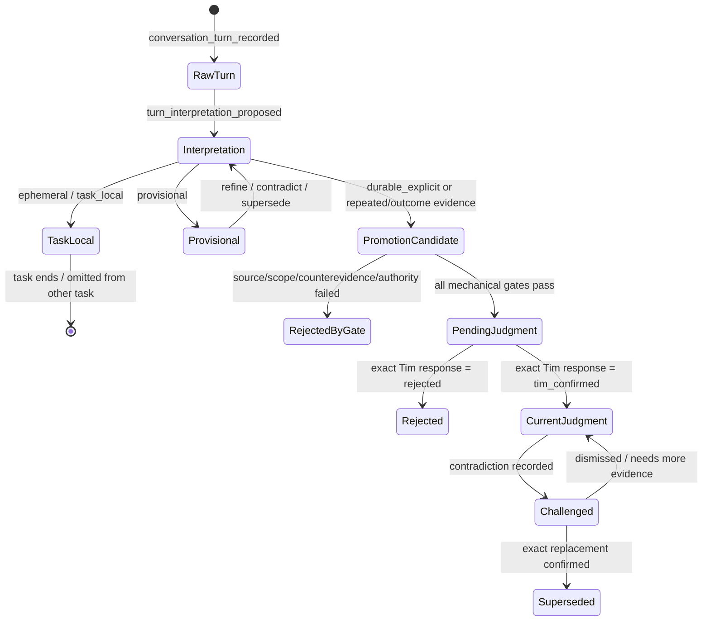

# VELO Creator Context Interpretation & Promotion v0

> 原文冻结标识：`creator-context-interpretation-promotion-v0 / 2026-08-06`
>
> 本文是本切片的完整架构原文与验收合同。实现可以在后续版本演化，但不得静默改写本版来制造“当初就是这么设计的”；变化必须新增版本或在文末变更记录说明。

## 0. 结论

VELO 的开发者/创造者 Agent 不应被设计成“把聊天记录塞进向量库，再让模型多想一会”的 Chatbox。它应当是一个有来源、有状态、有权限、有升格门槛、有反证、有行为评测的判断系统。

本版只交付最短的关键纵向切片：

```text
Tim 原话
  -> 不可变会话事件
  -> 模型生成的解释候选（仍然不是 Tim 观点）
  -> 当前任务状态 / 局部修正
  -> 独立机械升格防火墙
  -> Tim 对精确判断提案的确认或拒绝
  -> 结构化 Context 编译
  -> 真实纠错病例 replay / Eval
```

它首先解决一个比“记住更多”更基础的问题：系统怎样不把一句局部纠正、情绪表达、外部引语或模型总结，误写成 Tim 的长期规则。

## 1. 用户最终会得到什么

完成本切片后，Creator Agent 在机制上获得以下能力：

1. Context 压缩后仍可回到 Tim 的精确原话、来源、时间和主体，不以模型摘要冒充原话。
2. 同一句话可以同时被标注为纠正、问题、情绪、假设或指令，不被迫塞进一个互斥标签。
3. 当前任务纠正可由独立机械 Task State Engine 改变当前执行焦点，但不能发明任务、项目、验收或长期规则，也不会污染另一个任务。
4. 长期判断必须经过非补偿式门槛；“模型很自信”不能抵消来源、作用域、反证或权限失败。
5. 新旧说法不互相覆盖；旧解释保留，并以 `supersedes/refines/contradicts` 谱系说明变化。
6. Agent 只有在拿到精确旧判断、新证据、变化条件和相关结果时，才能向 Tim 发出有依据的独立提醒。
7. “不确定”是正式输出：歧义、情绪化身份语言和未解决反证进入 `UNKNOWNS`，不被模型补全成事实。

这不等于“Agent 已经像人一样理解 Tim”。本版证明的是：即使语义模型会犯错，错误也更难直接变成长效真相；同时错误能被回放、定位和校准。

本切片交付的是可组合的 Shadow 原语与纵向回放：Interpretation Agent、Task State Engine、Promotion Engine、HTTP Store/PG boundary 和 Eval 都能被测试显式串联，但仓库尚未提供真实模型、后台 UI 或生产 orchestrator 自动调用 Task/Promotion。删除这两个 executor 会破坏本切片测试与后续接线合同，却不会改变当前线上用户流程；因此这里不把“代码存在”表述成“生产 Agent 已接通”。

## 2. 第一性原理与故障模型

### 2.1 判断系统的最小事实

一个能工作的判断 Agent 至少要区分六种东西：

| 对象 | 是什么 | 不能冒充什么 |
| --- | --- | --- |
| 原话 Episode | 某人在某时通过某来源说了什么 | 当前真相、长期意图 |
| 解释 Interpretation | 模型对原话的可撤销理解 | Tim 原话、Tim 已确认判断 |
| 任务状态 Task State | 当前工作要做什么、做到什么程度 | Tim 的跨任务人格或规则 |
| 长期判断 Judgment | 经门槛与精确确认的慢变量 | 所有未来场景的绝对命令 |
| 反证/冲突 Conflict | 对既有判断的挑战证据 | 自动推翻旧判断的结论 |
| 行为校准 Calibration | Agent 的预测与真实结果 | 只看格式的静态单测 |

如果这六者被压进同一个 `memory` 文本字段，系统会出现三个连续放大的错误：

```text
上游解释幻觉
  -> 作用域/持久性误判
  -> Context Compiler 在后续每次调用中重复放大
```

所以问题的核心不是检索召回率，而是错误能否越权跨层传播。

### 2.2 非补偿式门槛

本版明确拒绝“给各维度加权，最后总分够高就写入长期记忆”。原因是某些条件不能互相补偿：

- 来源不是 Tim，置信度再高也不能成为 Tim 观点。
- 只适用于当前任务，重复次数再多也不能自动成为全局规则。
- 有未解决反证，语义相似度再高也不能升格。
- 没有精确确认，模型推理再漂亮也不能成为当前长期判断。
- 权限不允许，业务价值再高也不能写入。

因此升格采用“所有必需门槛均通过”的防火墙，而不是一个总分。

### 2.3 身份、作者与授权分离

`source_role=user` 只说明消息通过用户通道进入，不证明内容由 Tim 创作。最少还需：

- `actor`
- `authorship_basis`
- `source_message_ref`
- `source_ref`
- `rights_check`

用户粘贴的 GPT 总结、骑友反馈或文章引用必须保持外部作者身份，不能因为“是 Tim 发进来的”就变成 Tim 的判断。

## 3. 两类 Agent 的边界

### 3.1 Creator Agent（开发者/创造者）

职责：

- 保存 Tim 的产品判断、任务目标、设计演化和证据；
- 构建路线认知、工具、Eval 和 Published World；
- 读取私有原始材料；
- 生成解释和判断提案；
- 不能自行冒充 Tim 确认判断；
- 不能直接向骑友发布“真相”。

### 3.2 Rider Agent（骑友/消费者）

职责：

- 读取经过发布边界的路线认知和骑手自身授权数据；
- 生成骑行计划、解释推荐和导出静态路线；
- 不能读取 Creator 私有原话、Tim 未确认判断、内部反证或评测材料；
- 不能修改路线认知真值。

两者共享的是语言无关合同和已发布世界，不共享私有 Context 或数据库写权限。这是低耦合高内聚的产品边界，不是把同一个 Agent 换一份 Prompt。

## 4. 状态机



### 4.1 不可变原话

沿用 `creator.conversation_turn_recorded`：

- 保存 `raw_text` 与 `content_hash`；
- 绑定 `source_message_ref`；
- 绑定角色、作者和作者判定依据；
- 绑定 `subject_refs`；
- 只有精确的结构化 `judgment_response` 才能确认或拒绝一个判断。

解释永远引用原话，不修改原话。

### 4.2 解释候选

`creator.turn_interpretation_proposed` 是模型可写的主要语义事件，包含：

- `speech_acts[]`：观察、纠正、偏好、指令、决策、问题、假设、情绪、外部引语；
- `epistemic_status`：明确、推断、歧义、假设、未知；
- `scope_level/scope_ref`：本轮、任务、项目、跨项目、全局；
- `persistence_intent`：短暂、任务内、待观察、明确长期、未知；
- `annotation_basis`：直接语言、Agent 推断、机械生成；
- `claim/confidence`；
- `alternatives[]` 及每个替代解释的反证条件；
- `supporting_refs/counterevidence_refs`，v0 只接受同主体、权利允许的原始 turn/Evidence，不能引用另一层解释来洗白来源；
- `relations[]`：支持、矛盾、细化、替代；
- `action_effect/review_when`；
- 生成时使用的完整 normalized Context request、request hash、context hash 与模型版本。

它在类型名、权限和 Context 分区中都被标记为“候选”，没有任何字段能让它自己变成 Tim 真相。

### 4.3 当前任务状态

`creator.task_state_changed` 保存：

- 稳定 `task_ref` 和 `project_ref`；
- objective / focus；
- acceptance criteria；
- open loops；
- 当前状态 active / blocked / completed；
- 精确来源原话；
- 显式 supersession。
- 派生更新必须带 `source_interpretation_ref` 和固定 `engine_ref=creator-task-state-engine-v0`。

初始 Task State 必须由精确 Tim 原话建立。模型产生 `change_current_task` 解释后，`CreatorTaskStateEngineV0` 只允许复制当前状态的 project/objective/status/acceptance/open loops，并用该解释更新 focus、显式 supersede 旧状态；没有当前状态时拒绝执行。reducer 与 Python 投影会再次按 `source_interpretation_ref` 重验这些字段，持有 `task.update` 也不能跳过机械执行器偷换目标或验收。它的价值是让 Agent 知道“现在在干嘛、为何干、怎样算完成”，而不是积累成 Tim 人格画像。

### 4.4 升格防火墙

只有 `CreatorPromotionEngineV0` 可以生成 `creator.judgment_promotion_proposed`。语义模型不能从原话直接写这个事件。

所有升格共同要求：

1. 引用的解释存在、未被替代、主体一致；
2. `source_turn_refs` 必须与解释引用的原话精确相等；
3. 每条来源都必须是 Tim 的 direct/manual user turn，任何 `external_quote` 一律不能升格；
4. `action_effect=candidate_for_promotion`；
5. 不得处于歧义、假设或未知状态；
6. 不得保留未解决 alternatives 或 counterevidence；
7. reducer 用事件发生前的 View 和完整 normalized request 重编 Context，模型身份、编译器版本、请求哈希、内容哈希、正数预算及可见 interpretation 必须精确一致；
8. 最终仍只是待审判断，必须由 Tim 对“这条精确 statement/hash”确认。

四类升格依据：

| 依据 | 硬条件 |
| --- | --- |
| `durable_explicit` | Tim 精确原话；直接语言；明确的 instruction/decision；项目/跨项目/全局作用域 |
| `repeated_independent_tasks` | 至少两个不同 task_ref、不同 source_message_ref；每个 task_ref 都有精确引用该原话的真实 Task State；均为 provisional 或 durable；不是同一上下文重复回声 |
| `validated_outcome` | 精确校准记录；pass；real-world 权威；同时绑定解释与同主体 Evidence；判断自身携带该 Evidence |
| `high_cost_failure` | 精确校准记录；fail；real-world 权威；同时绑定解释与同主体 Evidence；判断自身携带该 Evidence |

“Tim 说了这句话”与“Tim 确认这条规范化判断”是两件不同的事。前者允许形成候选，后者才允许成为 `current_judgment`。

### 4.5 冲突与独立提醒

Agent 的批判性思考不定义为“经常反对 Tim”，而定义为：

- 能发现当前提案与已确认判断的明确关系；
- 能同时取回旧判断原话、当前新原话、变化条件和历史结果；
- 能区分 `contradicts`、`refines` 与 `supersedes`；
- 证据不足时输出未知或请求澄清；
- 不用过往情绪、身份假设或无关项目来阻止当前任务。

`CONFLICT_PACKET` 只包含与当前主体、任务和有效权利相关的精确关系。它让模型有材料提出挑战，但不会自动推翻判断。

## 5. Context Compiler v1

逻辑分区为：

```text
MUST_OBEY
  = 当前 Tim-confirmed、未替代、未过期、权利允许的判断

CURRENT_TASK
  = 与 task_ref 精确匹配的当前任务状态

ACTIVE_JUDGMENTS
  = 当前主体的有效长期判断

JUDGMENT_SOURCE_TURNS
  = 当前/待审判断背后的精确原话与确认原话

LOCAL_INTERPRETATIONS
  = 当前任务或当前主体相关的模型解释候选，明确标注非真相

INTERPRETATION_SOURCE_TURNS
  = 每条活跃解释背后的精确不可变原话，包含 actor/source_role/authorship/source_ref

CONFLICT_PACKET
  = contradicts/refines/supersedes 关系、目标、来源原话、理由、review 条件、替代解释、反证与历史校准

CONFLICT_SOURCE_TURNS
  = 冲突两端的旧/新精确原话，不因旧解释已 supersede 而丢失

UNKNOWNS
  = 歧义、假设、未知、需要澄清，或仍带 alternatives/counterevidence 的解释

OMISSIONS
  = 因作用域、权利、过期、预算、替代等被省略的引用与原因
```

代码中 `current_judgments` 是 `MUST_OBEY` 与 `ACTIVE_JUDGMENTS` 的唯一实体数组：前者描述它对执行的作用，后者描述它的认识论身份。v0 不复制两份相同数据，避免 token 浪费和两个区块漂移；这两个名称是同一实体的逻辑别名，不是两个可独立修改的真值集合。

关键纪律：

- task-local / ephemeral 解释只有 `task_ref` 精确相等时可见；
- project 解释只有当前 `task_ref` 对应 Task State 的 `project_ref` 精确相等时可见；cross-project/global 才允许跨项目；
- 已被替代的解释不进入活跃 Context，但仍保留在事件谱系；
- 权利不是 allowed 的原话、解释所引用的原始支持/反证，以及对应 Task State 全部 fail closed；
- 原话一旦形成解释就不再作为“未处理输入”反复投喂，防止模型重复提取；
- 已处理原话不再出现在 pending input，但必须随活跃解释进入独立 source-turn 区块，压缩后仍可逐字追溯作者与来源；
- 每个 Context 有 request hash、context hash、源 revision 和 omission manifest；
- PostgreSQL 关系投影与事件真值不一致时，在模型调用前停止。
- `subject_refs` 必须显式非空；原话带多个隐私标签时，请求必须覆盖全部标签，否则整条原话省略，不能用“任一标签相交”泄露另一主题。

## 6. 数据库设计

### 6.1 真值与投影

继续保持两层：

1. `creator_workspace_events` 是追加式事件真值，保存鉴权回执和完整 payload；
2. 关系表是在同一 PostgreSQL 事务中写入的可重建投影。

TypeScript Agent 不直接连接数据库。Python Domain Plane 负责：

- authenticated principal；
- capability gate；
- workspace revision CAS；
- 同一事务写事件和投影；
- event id 幂等；
- 独立重建 projection records；
- projection drift-stop。

### 6.2 新关系表

| 表 | 作用 | 关键约束 |
| --- | --- | --- |
| `creator_turn_interpretations` | 原话解释、作用域、替代谱系、生成 Context | 精确 turn FK、自引用 supersedes、枚举检查 |
| `creator_task_states` | 当前任务目标、焦点、验收、开放循环 | 同 task 仅一个未替代状态、精确原话依据 |
| `creator_behavior_calibrations` | 预测、结果、评测权威 | context item 必须已存在；权威与 verdict 分离 |
| `creator_judgment_interpretations` | 长期判断到解释的精确 lineage | 双向 FK，不接受任意字符串冒充依据 |

`creator_judgments` 增加：

- `proposal_event_type`
- `context_task_ref`
- `context_max_interpretations`
- `promotion_basis`
- `promotion_basis_refs`

`creator_workspace_events` 增加：

- `derivation_key_id`
- `derivation_signature`
- `derivation_prior_records_hash`

interpretation、Task State、calibration、promotion 与 schema v2 evidence judgment 都是派生事件。HTTP Store 必须先用 TypeScript reducer 对“事件 + 精确前序 records + principal/capability”做完整预演，再用 Ed25519 私钥生成 attestation；Python 只持公钥，在 revision CAS 和写事件之前重算前序 records hash、事件 payload hash、身份和权限并验签，数据库 check 再要求派生事件物理上必须携带证明。验签 key descriptor 还必须明确允许的 principal、environment 与 capability，所以普通 bearer credential、Python verifier 或越权 key 都不能伪造派生状态。当前代码只提供注入式 signer/verifier，生产 composition root 和密钥托管/轮换不在本切片范围，因此没有生产挂载就没有“假安全”。

Calibration 还使用二级 authority capability：`agent_assessed / mechanical / tim_confirmed / real_world` 分别需要独立 scope，数据库事件 receipt 保存实际使用的精确 authority capability。拥有一般 `behavior.calibrate` 的适配器不能自称 Tim 或真实世界权威；未来接线时 `tim_confirmed` 必须来自真实审核身份，`real_world` 必须来自可追溯的结果适配器与同主体 Evidence。

数据库 check constraint 要求：`creator.judgment_proposed` 的 promotion 字段必须全空；`creator.judgment_promotion_proposed` 的 promotion bundle 必须完整且预算为 JavaScript safe positive integer。这样两条事件族不能互相伪装。

兼容策略按 schema version 分开：历史 `schema_version=1 + creator.judgment_proposed` 允许按原合同冷回放既有 conversation judgment；新 `CreatorAgentV0` 只发 `schema_version=2`，该版本只允许路线/领域 Evidence 且 `source_turn_refs` 必须为空。模型解释 principal 没有 `judgment.propose`，新对话长期判断必须走 interpretation → promotion。这样既不破坏 append-only 历史，又关闭新写入的对话直写路径。

TypeScript reducer/compiler 是完整语义所有者，会重编 Context 证明 interpretation、schema v2 evidence judgment 与 promotion hash。Python Domain Plane 不复制这套 Context 选择算法；它校验 exact event、schema、来源/主体/项目/权利、模型与 compiler 身份、正数预算、capability 和数据库关系约束，并验证上述 reducer attestation。Python 单独看到一个 context hash 或一个高权限 bearer 都不构成证明。

### 6.3 并发、失败与恢复

- 所有事件以 `base_revision` 做 CAS；并发写只有一个成功；
- 事件与关系投影同一事务，任一约束失败全部回滚；
- event id 相同且 payload 相同返回幂等回执；内容不同报冲突；
- Client 在网络失败后 read-after-error，只接受相同 principal、capability 和精确 payload；
- 解释替代和任务状态替代显式引用当前版本，不做 last-write-wins；
- 关系投影能在不读取 `payload_json` 的情况下重建完整事件，供 TypeScript 冷重放对账。

## 7. 外部设计考古：吸收什么，拒绝什么

本节记录实际阅读的当前一手实现，不把项目名当作装饰。

| 系统与快照 | 吸收 | 拒绝/补强 | 假使用信号 |
| --- | --- | --- | --- |
| Reborn stable + 2026-08-06 understanding WIP（本地只读） | 原话/候选/当前明确分层；学习证据梯；任务分支；解释多标签；belief promotion gate；真实 Tim 病例 | WIP 的 basis ref 未精确绑定、context_id 可伪造、后续反证不会自动挑战、缺权利/新鲜度/PG CAS 等问题在 VELO 补上 | 只复制八层名词，却不能阻止错误 basis ref 或跨任务泄漏 |
| [Pi mono](https://github.com/badlogic/pi-mono) `69bab864` | 内外 loop；steering；追加 Session entry；compaction summary + retained tail；单写者 record reducer；损坏状态 fail closed | Pi 的会话恢复不负责“用户一句话能否成为长期判断”，因此不能代替 Promotion Firewall | 能继续 session，但无法解释某条长期规则来自哪句原话、为何升格 |
| [LangGraph](https://github.com/langchain-ai/langgraph) `658541c4` | 每个 superstep checkpoint；pending writes；thread/checkpoint identity；interrupt/resume；失败后不重跑已成功节点 | Graph checkpoint 解决执行恢复，不自动解决认识论与 Tim 归因 | 图能恢复，但 checkpoint 里的错误信念仍被当真 |
| [OpenAI Codex](https://github.com/openai/codex) `7a0e974e` | 追加 rollout JSONL；session/thread/turn 作用域存储；工具 start/finish outcome；权限、风险、用户授权分开；compaction handoff | Compaction summary 是恢复线索，不应成为用户长期真相；开发工具审批不能直接充当产品判断审批 | 有完整日志，却把 summary 当原话，或把一般用户授权当精确判断确认 |
| [Claude Code memory/permissions](https://docs.anthropic.com/en/docs/claude-code/cli-usage) | 项目/用户/目录级作用域；工具 allow/deny；显式选择写入 memory；resume session | CLAUDE.md 是人工指令面，不适合作为自动生成的 Tim 可变人格库 | 自动把每次纠正追加进全局指令文件 |
| [Graphiti](https://github.com/getzep/graphiti) `425bf248` | 原始 episode；边的 valid/invalid 时间；来源 episode；旧事实失效而非删除 | LLM 自动抽取矛盾并失效关系不能直接拥有 Tim 判断权；本版不引入图数据库 | 有知识图谱，却无法回到原话或区分模型推断和 Tim 确认 |
| [Hindsight](https://github.com/vectorize-io/hindsight) `436bc7c` | World/Experience/Mental Model 分层；retain/recall/reflect；防记忆回声；历史不能命令当前任务；行为 benchmark 显示弱记忆会伤害 | 将 correction/preference 自动归为 world fact 风险过高；Reflect 结果不是 Tim 真相 | Recall 更高但任务成绩下降，仍宣称“记忆更强” |
| [LangMem](https://github.com/langchain-ai/langmem) `7c7ebf36` | semantic/episodic/procedural；hot-path 与 background consolidation；namespace | Agent 自主 CRUD 长期用户 profile、归纳/溯因并直接更新删除，缺少独立升格权限 | 模型能写删 profile，却没有精确来源和确认回路 |
| [LongMemEval](https://arxiv.org/abs/2410.10813) | 把抽取、多会话推理、时间推理、知识更新、拒答拆开评测 | 单一“记忆准确率”不能证明真实生产判断力 | 只测能否召回字符串，不测过度升格、作用域泄漏和应当拒答 |

共同结论：执行恢复、检索召回、知识图谱、长上下文和更强模型都重要，但它们不能互相替代。VELO 需要把它们放在各自正确的层，而不是选一个框架统一包办。

## 8. 真实 replay / Eval

固定病例位于 `agent_runtime/creator/eval/tim-context-cases-v0.ts`。病例保留日期、原话摘录和期望边界，但不把期望标签当成 Tim 长期规则。

v0 至少覆盖：

1. “腾讯怎么了？”——当前回答的纠正，只影响当前 task；
2. “不是时长，是录制时间和分析时间”——局部概念纠正；
3. “不是所有机制全部并行，是需要时可取回”——保留前后解释谱系；
4. “纠正一句不应该立刻升格成规则”——明确的项目级升格防火墙，但仍需精确确认；
5. “天选之子”类情绪化身份语言——歧义/情绪，正式拒绝升格；
6. 外部 Agent/GPT 总结——保持外部作者，不归因给 Tim。

机械指标：

| 指标 | v0 验收 |
| --- | --- |
| false promotion | 0 |
| task-local scope leak | 0 |
| superseded interpretation leak | 0 |
| unconfirmed judgment in current truth | 0 |
| ambiguous identity abstention | 必须进入 UNKNOWNS |
| exact confirmation binding | proposal id + statement hash + Tim turn 全部一致 |
| PostgreSQL bypass | 无 reducer attestation、v1 在线直写、错 model/compiler、非正数预算、跨主体/项目、外部作者、非法 basis 或非法 Task update 全部在落盘前拒绝；context hash 的完整重放证明由 TS reducer 所有，Python 验签，projection drift-stop 再做读侧独立对账 |

这些测试验证的是系统边界。真正语义模型上线后还必须加入 unseen cases、模型版本对照、Tim 首次理解率、重复纠正率和真实任务结果。

## 9. 明确目标、非目标和验收

### 9.1 目标

在 VELO TypeScript Creator Agent 中交付可回放的 Context Interpretation & Promotion v0，分离原话、解释、任务状态、长期判断、冲突和行为结果，并把同一门槛落实到 PostgreSQL 持久化边界。

### 9.2 非目标

- 本版不接真实 LLM；只提供 port 和 deterministic Shadow；
- 不声称语义分类对所有新表达都正确；
- 不自动生成 Tim 人格/身份 profile；
- 不实现 Rider Agent UI；
- 不发布路线世界，不触碰 `users/activities/segments/segment_efforts`；
- 不引入 Neo4j/图数据库；
- 不部署生产 Creator 身份或生产数据库迁移；
- 不把 Python 改造成 Agent runtime；Python 只保留 Domain Plane 事务边界。

### 9.3 验收标准

代码层：

- 新事件 exact-key、Unicode、枚举、作用域和引用验证；
- 解释 Agent 只能写 interpretation，不能直接写长期判断；
- 升格器与 reducer 双重验证门槛；
- `change_current_task` 由机械 Task State Engine 真实生成 superseding Task State，而不是只存一个无效果标签；
- 同 event id 只有完整请求逐字段相同才幂等；statement、basis、interpretation、task 或时间任一改变都报冲突；
- task-local 解释不跨 task_ref；
- 已替代解释不进入活跃 Context；
- 外部引语、歧义身份、未解决反证不能升格；
- 长期判断只有精确 Tim response 后才进入 current；
- JSONL 冷重放确定；
- Context manifest 包含 task/interpretation/conflict/omission refs。
- Context 同时携带判断原话、解释原话、冲突两端原话和校准结果；多主体原话必须全标签显式授权。校准只有在 task 匹配且全部 context refs 的主体、当前权利与作用域闭包都可证明时才能进入 Conflict Packet；Manifest 必须列出目标、校准及其 context refs。

数据库层：

- 新迁移 upgrade/downgrade 空库回环；
- 新表和判断 lineage 关系投影完整；
- 事件与投影同事务；
- 直接绕过 TS 的非法升格被 PostgreSQL service 拒绝；
- 派生事件必须通过 TypeScript reducer attestation；签名绑定 exact event、前序 records、principal 和 capability，证明字段受数据库 check 保护；
- schema v2 evidence judgment 可真实写入；schema v1 judgment 只能冷回放、不能在线 append；
- projection records 与 event truth 完全相等；
- CI 在临时 PostgreSQL/PostGIS 上不允许跳过。

交付层：

- TypeScript typecheck 和全量 Agent tests 通过；
- Python 相关测试通过；
- schema/鉴权/状态变更做独立 spec 忠诚审查；
- 做跨模块集成审查；
- PR CI 通过且分支跟上 main；
- 合并后清理任务分支/工作树；
- 本切片不改变用户可见生产行为，因此不部署。

## 10. 实现映射

| 架构对象 | 实现 |
| --- | --- |
| 事件与 View | `agent_runtime/creator/state/types.ts` |
| exact validation / reducer / JSONL replay | `agent_runtime/creator/state/engine.ts` |
| reducer derivation attestation | `agent_runtime/creator/state/derivation-attestation.ts` |
| interpretation model port | `agent_runtime/creator/interpretation/model.ts` |
| interpretation runtime | `agent_runtime/creator/interpretation/agent-v0.ts` |
| promotion firewall | `agent_runtime/creator/interpretation/promotion.ts` |
| task focus executor | `agent_runtime/creator/interpretation/task-state.ts` |
| Context Compiler v1 | `agent_runtime/creator/context/compiler.ts` |
| replay metrics | `agent_runtime/creator/eval/interpretation-replay.ts` |
| Tim replay cases | `agent_runtime/creator/eval/tim-context-cases-v0.ts` |
| Domain Plane ORM | `app/creator_persistence/models.py` |
| Domain Plane transaction gate | `app/creator_persistence/service.py` |
| migration | `migrations/versions/20260806_creator_ctx_v1.py` |
| TypeScript behavior tests | `tests-ts/creator-context-interpretation.test.ts` |
| PostgreSQL contract tests | `tests/test_creator_persistence_pg.py` |

## 11. 后续顺序

本切片完成后，合理顺序不是立刻做更大的“人格记忆”，而是：

1. 接入一个真实 interpretation model adapter，以 unseen Tim cases 做 Shadow；
2. 记录 first-understanding / repeat-correction / abstention / context-usefulness；
3. 做 Creator 内部 Review UI，展示原话、解释、替代解释、反证和 promotion basis；
4. 将同一套 interpretation/promotion 机制用于路线认知材料与骑友反馈；
5. 只有证据循环稳定后，才把已发布路线世界提供给 Rider Agent；
6. Rider Agent 保持独立权限和 Context，不读取 Creator 私有层。

到那时，“有判断力”才逐渐从架构潜力变成可观察的产品能力。

## 12. 变更记录

- 2026-08-06：冻结 v0 原文；建立原话、解释、任务、升格、确认、Context、PG 与 replay 的最短纵向切片。
- 2026-08-06：防绕过校准；新 schema v2 入口限 Evidence、schema v1 仅保留历史回放，跨任务重复必须有真实 Task State，结果升格必须携带同主体 real-world Evidence。
- 2026-08-06：独立审查修正；保留 interpretation 精确原话与完整 Context request，关闭递归引用洗权、主体/项目泄漏、伪造 promotion hash/model/0 预算和 projection fallback；新增 Task State Engine，并逐个执行六个 Tim 病例。
- 2026-08-06：第二轮独立审查修正；分离 replay/append validator，关闭 v1 在线判断直写；Promotion/Task retry 改为从 pre-event View 重建完整期望事件；Task update 绑定解释和机械引擎；Context 补齐旧/新原话与校准结果；派生事件增加 reducer attestation 和 PostgreSQL 物理证明约束。
- 2026-08-06：第三轮独立审查修正；对称 HMAC 改为 TS 私钥签名、Python 公钥验签的 Ed25519 边界并限制 key 的 principal/environment/capability；interpretation support 与 calibration 建立全主体、当前权利、同任务闭包；Manifest 补齐 conflict target/calibration lineage；Python exact retry 绑定原提交身份。
- 2026-08-06：第四轮独立审查修正；多主体 turn 不得充当单主体 contradiction，Compiler 的遗漏原因不再旁路暴露被撤权或跨主体对象 ID；JSONL exact retry 与 PostgreSQL 一样绑定原 principal receipt；PostgreSQL calibration 投影从关系表独立重算主体、当前权利与任务闭包，不把 TypeScript attestation 当作唯一防线。
- 2026-08-06：最终攻击复验修正；Compiler、Reducer 与 PostgreSQL 统一递归遍历 turn、evidence、source interpretation、promotion basis、contradiction 与 nested calibration 的主体和当前权利闭包；完整 B 主体冲突不能借 A endpoint 泄露，supporting source 撤权会关闭派生 judgment/calibration，历史空主体在任何包裹层都 fail closed；两类独立审查最终均为 Critical/Important/Minor 0。
