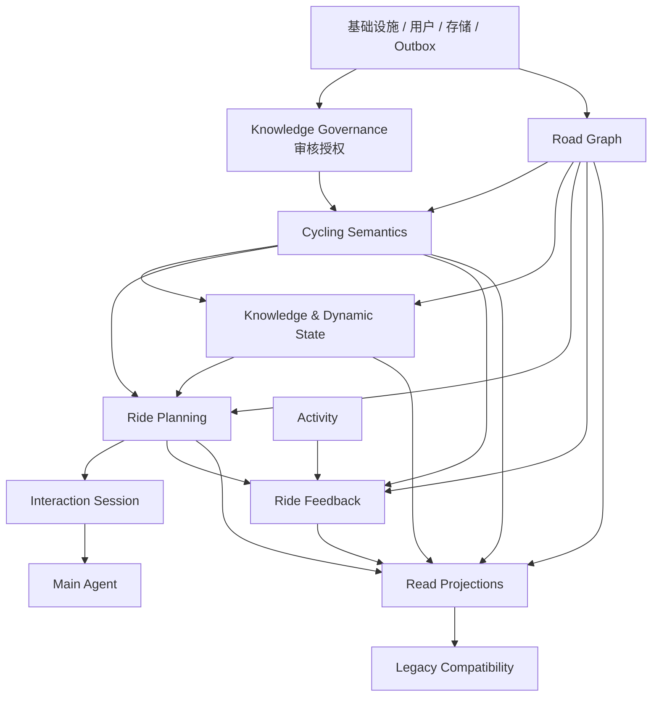
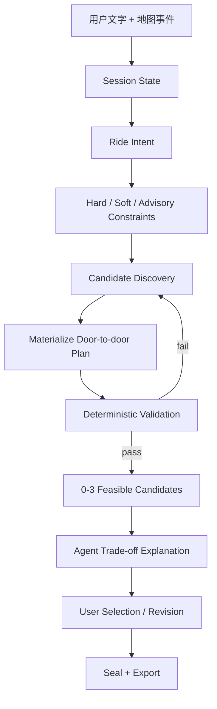
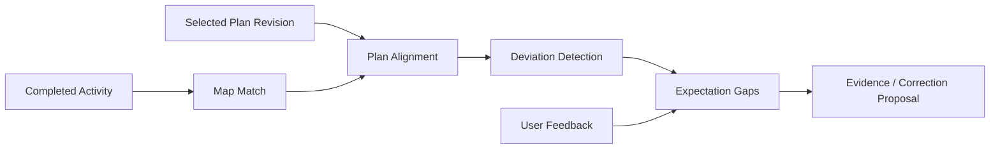

# VELO 目标领域架构与渐进式迁移蓝图 v1.0

> **目标**：以《VELO 路线认知基础设施 v0.1》作为新的目标领域架构，以 `Starsky618/-velo` 当前 `main@433ec012ac44592688e95cc681be6d630f3a51c2` 作为工程基线，设计一条不推倒现有系统、但能逐步演化为“本地骑行世界模型 + 计划决策系统”的实施路线。
>
> **结论先行**：现有系统不应被重写；但 `RouteBook → RouteVersion → RouteGuide` 也不能继续充当新世界模型的中心。它们应退回到“用户保存轨迹、可导出导航快照、旧页面投影”的边界。真正的新中心应是：
>
> ```text
> 道路图事实
>   ↓
> 强类型骑行语义对象 + 方向性 Traversal
>   ↓
> 来源 / 证据 / 原子主张 / 多维质量 / 动态状态
>   ↓
> 本次 Ride Plan（唯一完整、精确、可导出的门到门方案）
>   ↓
> Session + 地图事件 + Agent 工具调用
>   ↓
> Activity 对齐、偏离、骑后预期差和纠错
> ```

---

## 0. 文档地位、审计范围与冲突裁决

### 0.1 本文档的优先级

后续实现遇到冲突时，按以下优先级裁决：

1. **新的目标领域文档**决定“现实世界里有哪些对象、对象语义是什么、AI 有什么权力”。
2. **当前运行代码与数据库迁移**决定“系统今天实际上能做什么”。
3. **当前架构文档与 ADR**解释既有设计意图，但若与代码不一致，以代码为准。
4. **历史 PRD、归档计划、旧内容页**只能作为背景或迁移证据，不得反向定义新领域模型。

这意味着两类旧结论必须被显式修订：

- 旧 `route_cognition v1.1` 的“`route_books` 是路线身份”不再成立；`route_books` 只继续是旧路书/轨迹资产身份。
- 旧 ADR-009 中“Agent 只是后期附加建议”的产品定位不再成立；Agent 现在是核心交互与取舍层，但“Agent 不拥有事实、不直接写正式知识、可替换”这一工程边界继续成立。

### 0.2 仓库审计范围

本次审计以当前 `main` 为基线，覆盖了：

- 根目录运行与部署结构；
- FastAPI 入口、同步 SQLAlchemy 会话、Redis/RQ 工作流；
- `activity`、`segment`、`route_book`、`route_cognition`、`agent`、`meetup`、`elevation`、`strava`、`training` 等领域模块；
- 关键 ORM 模型、服务、writer、写入门禁、导入导出、匹配与海拔计算；
- Alembic/架构状态与数据流文档；
- 小程序路线列表、路线详情、地图页、路线绘制入口；
- `content/routes/**` 种子内容及内部 First Visible Slice；
- 与本次架构有关的 ADR-008、009、010、012。

不属于领域架构审计重点的静态图片、纯样式文件和大量历史归档计划，没有逐字逐文件复述；它们不影响本蓝图中的数据库和服务边界判断。

### 0.3 当前仓库的真实状态

当前系统已经不是空壳，已有以下可靠能力：

- GPX/FIT/Strava Activity 导入、轨迹点存储、状态机与异步 Worker；
- PostGIS 空间查询与赛段自动匹配；
- 路书上传、活动派生、腾讯规划、手工绘制；
- 路线海拔统一计算、轨迹版本、GPX/TCX 导出、文件权限与陈旧制品校验；
- 路线认知的 judgment/evidence/research 台账、segment 白名单、typed candidate、formal link、collection membership、内部 writer 和人审门禁；
- 旧路线百科文章页、单条轨迹地图与导出；
- Activity、Segment、Meetup、Training 等既有产品链路。

但它仍缺少新目标的五个核心地基：

1. 可被语义对象引用的真实道路拓扑；
2. Area / Named Route / Named Line / Climb / Destination / Classic Ride 的强类型身份；
3. 原始来源、证据、原子主张、多维可信度和有效期的完整知识层；
4. 真正的 Ride Plan、Plan Leg、约束、候选、验证和版本；
5. 对话与地图共享 Session State，以及 Activity→Plan→反馈闭环。

---

# 第一部分：总判断

## 1. 不是重写，而是一次“中心迁移”

现有 VELO 的中心大致是：

```text
Activity / Segment
        ↓
RouteBook + RouteVersion
        ↓
RouteGuide / Meetup / Export
```

目标系统的中心必须改成：

```text
Road Graph
    ↓
Cycling Semantics
    ↓
Knowledge + Time
    ↓
Planning
    ↓
Interaction
    ↓
Feedback
```

两者不是互斥关系。正确的演化方式是 **Strangler Pattern（绞杀者迁移）**：

- 旧链路继续服务现有页面和用户数据；
- 新模块只通过明确适配器读取旧对象；
- 新能力只写新模型；
- 新模型通过投影兼容旧 API，而不是新旧双向互写；
- 当新读链路达到质量门槛，再逐页切流；
- 旧表最后可以长期保留为个人路书、排行榜赛段或历史投影，并不要求全部删除。

## 2. 当前最重要的语义纠正

### 2.1 `RouteBook` 不是“路线世界中的 Route”

`route_books` 当前同时允许：

- 文件上传；
- Activity 派生；
- 腾讯规划；
- 手画路线；
- 人工组合；
- AI 生成。

这些对象的共同点只是“有一条可保存、可显示、可导出的线”，而不是拥有同一种现实世界身份。因此：

> `RouteBook` 应重新定义为 **Saved Route Artifact / Legacy Navigation Template**，而不是 Named Route、Classic Ride 或 Ride Plan 的共同父类。

### 2.2 `Segment` 不是 Road Section

现有 `segments` 是排行榜与计时对象：

- 起终点由创建者定义；
- 边界可能重复或任意；
- 有方向、成绩、排名与匹配容差；
- 一条道路可能对应多个 Segment；
- 很多真实连接道路根本没有 Segment。

因此：

> `Segment` 可以作为 Climb、方向性道路体验和热门边界的证据；不能直接作为道路拓扑边。

### 2.3 `RouteCollection` 不是统一的 Cycling Area

当前 `route_collections` 同时承载：

- area system；
- route family；
- race route family；
- training corridor；
- theme pack。

其中只有经过审查的 `area_system` 可能迁移为 Cycling Area。训练主题、赛事专题和路线包仍是编辑集合，不应强行升级为现实世界对象。

### 2.4 `ConceptNode` 不是所有语义对象的万能父类

`ConceptNode` 可以继续承载：

- 本地黑话；
- 训练主题；
- 风险词汇；
- 路况词汇；
- 事件标签。

但安顶山、天龙山、中线、萧山天路、经典环线必须拥有强类型表和生命周期，不能只是一枚 `node_type='place'/'local_term'` 的标签。

## 3. 一项必须先修的真实地基缺陷

代码把 `RouteVersion` 描述为不可变快照，但 `scripts/import_route_guides.py::refresh_current_route_version` 会原地覆盖当前版本的：

- `reference_line_snapshot`；
- `line_hash`；
- `distance`；
- `climb`；
- `elevation_profile`；
- `elevation_points_snapshot`。

这会破坏：

- 历史导出究竟基于哪条线；
- judgment/evidence 引用的几何是否仍是原几何；
- 未来 Plan 是否能回放；
- “版本替代而非并存方案”的基本语义。

必须在任何新世界模型迁移之前修复：

1. 增加 `sealed_at` 或明确 sealed 状态；
2. 未封存、未发布、未导出的 pending 版本可补齐计算结果；
3. 一旦封存，几何、逐点海拔和输入 hash 不可原地修改；
4. 官方轨迹变化时创建新版本、归档旧版本、原子切换 head；
5. 加 `UNIQUE(route_book_id) WHERE status='current'`；
6. 所有导出、判断与未来 Plan 永远绑定具体版本和 hash。

---

# 第二部分：目标模块架构

## 4. 部署形态：继续模块化单体，不急着拆微服务

下一阶段仍建议使用：

```text
FastAPI API
PostgreSQL + PostGIS
Redis + RQ Worker
Local/Object Storage
微信小程序
```

但代码内形成严格的 bounded context。现在拆微服务会把尚未稳定的领域边界提前固化成网络边界，增加：

- 分布式事务；
- 服务间鉴权；
- 数据同步；
- 事件补偿；
- 调试难度；
- 部署成本。

正确顺序是：

1. 先形成模块、表所有权、命令和查询接口；
2. 禁止跨模块直接修改 ORM；
3. 用 Outbox 把投影和异步副作用解耦；
4. 等 Map Matching、Agent 或外部检索真的出现独立扩缩容需求时再拆进程或服务。

## 5. 新的模块边界

建议新增以下顶级模块；不要继续把所有内容堆进 `app/route_cognition/models.py`：

```text
app/
├── road_graph/             # 物理道路拓扑与图快照
├── cycling_semantics/      # 骑行区域、路线、线路、爬坡、目的地、经典骑法
├── knowledge/              # 来源、证据、主张、冲突、质量、动态状态、审核授权
├── ride_planning/          # 意图、约束、候选、Plan、Leg、验证、导出
├── interaction/            # Session、对话、地图事件、地图动作、工具调用
├── ride_feedback/          # Activity 对齐、偏离、骑后反馈、预期差、纠错
├── world_projection/       # 地图/搜索/卡片/旧 API 等读模型
├── compatibility/          # RouteBook/Guide/Segment/Collection/Meetup 适配
└── agent/                  # 主 Agent，仅编排工具，不拥有事实
```

现有模块保留：

```text
activity       真实骑行记录与轨迹
segment        排行榜赛段与成绩
route_book     用户保存路线与旧导出链
route_cognition旧审核/关系台账，逐步冻结
meetup         约骑产品
training       训练分析
strava         外部活动同步
```

## 6. 模块依赖方向

唯一允许的主依赖方向：



关键规则：

- `road_graph` 不依赖骑行语义；道路不知道“天龙山”。
- `cycling_semantics` 可以引用道路图，但道路图不能反向引用 Named Route。
- `knowledge` 可以针对道路/语义对象建立主张，但不能直接修改对象。
- `ride_planning` 只读取道路、语义和知识，通过自己的命令写 Plan。
- `ride_feedback` 只能提出新的 evidence/claim candidate，不能直接修正道路或路线身份。
- `agent` 不导入任何 ORM，不直接写正式知识和正式关系。
- `projection` 只消费事件与只读接口，不成为任何上游模块的真相源。

## 7. 同一进程内也必须使用“端口”

即使暂时还是一个 FastAPI 进程，也应定义稳定接口：

```python
class RoadGraphReader(Protocol): ...
class SemanticCatalogReader(Protocol): ...
class KnowledgeReader(Protocol): ...
class PlanCommandService(Protocol): ...
class SessionCommandService(Protocol): ...
class ExportableNavigationSnapshot(Protocol): ...
```

Agent 与 Planning 只依赖这些端口，不依赖：

```python
from app.route_book.models import RouteBook
from app.route_cognition.models import ConceptNode
```

初期可以用 in-process adapter；未来若 Agent 或 Map Matching 拆服务，只替换成 HTTP/MCP/gRPC adapter，不改领域逻辑。

---

# 第三部分：领域对象真实语义与生命周期

## 8. 物理、语义、方案与事实必须分层

### 8.1 Road Section

**语义**：某个道路图快照中的一段有明确两端节点、方向与物理属性的道路边。

它拥有：

- 精确几何；
- 起终节点；
- 长度；
- 道路等级；
- 表面；
- 自行车/机动车通行属性；
- 单向规则；
- 桥、隧道等静态属性；
- 静态来源与图快照。

它不拥有：

- “天龙山”“中线”等名字；
- “适合新手”“风景好”等评价；
- 今天施工或封路这种动态状态；
- 任何用户本次方案身份。

生命周期：

```text
imported → validated → active-in-snapshot → retired-with-snapshot
                                  ↘ lineage(split/merge/realigned)
```

Road Section 不在原地改几何。道路图更新时创建新 snapshot，并通过 lineage 记录拆分、合并、校正关系。

### 8.2 Cycling Area

**语义**：有共同本地骑行身份的路网区域，如“萧山天路”或未来的“太原西山骑行体系”。

它可以拥有：

- 近似或明确边界；
- 主要 Named Line；
- Climb；
- Destination；
- Classic Ride；
- 主要连接结构。

它不是：

- 一个大 GPX；
- 一个训练主题集合；
- 一个行政区；
- 一篇攻略。

生命周期：

```text
candidate → draft → reviewed → published → revised/superseded → archived
```

区域边界可以标记为 `exact / approximate / display_extent`，避免假装语义边界具有行政边界般的绝对精度。

### 8.3 Named Route

**语义**：由公认核心主线、核心爬坡、风景道路或目的地身份定义的一条本地路线。

身份规则：

- 正反骑通常是同一个 Named Route；
- 市区出发和坡底出发仍是同一 Named Route；
- 不同方向拥有不同 Traversal 与体验；
- 不同接入、退出、返程属于 Ride Plan；
- 永久核心道路改变才产生新的语义 revision。

### 8.4 Named Line

**语义**：Cycling Area 内被当地骑手稳定识别的主要线路，如东线、中线、西线。

必须拥有：

- 所属区域；
- 起止边界或标志点；
- 方向性 Traversal；
- 所经主要 Destination；
- 与其他线路的连接关系；
- 被审核的道路范围。

### 8.5 Climb

**语义**：一个有明确起点、终点和上升方向的骑行爬坡对象。

规则：

- Climb 天生有方向；
- 同一条道路反向下坡不等于同一个 Climb 体验；
- Strava/现有 Segment 只能提供候选边界、热度和方向证据；
- 正式 Climb 边界要经过轨迹、道路图和本地认知共同校准。

### 8.6 Destination

**语义**：用户可以明确表达“我想去这里”的骑行目标地点。

例如：

- 山顶；
- 观景台；
- 村庄；
- 寺庙；
- 补给点；
- 具有稳定骑行意义的地标。

Destination 不是普通地图 POI 的无差别复制；只有对骑行任务有稳定意义的地点才进入正式语义层。

### 8.7 Classic Ride

**语义**：当地骑手反复使用、可被重复识别、具有共同认知的一种核心组合。

它拥有：

- 有序的线路/爬坡/连接/目的地步骤；
- 方向性 variant；
- 重复出现的活动证据；
- 典型结构和适用场景。

它不等于：

- 任意一条用户 GPX；
- 仅有一次的拼接；
- 用户从家门口出发的完整 Plan。

### 8.8 Traversal

这是新文档隐含但代码必须显式拥有的技术领域对象。

**语义**：某个可骑语义对象在一个具体方向上的骑行解释。

例如：

- 天龙山正向上山；
- 天龙山反向；
- 中线北向；
- 某经典环线顺时针；
- 某经典环线逆时针。

方向相关的以下内容全部绑定 Traversal，而不是路线身份：

- 爬坡顺序；
- 难点位置；
- 下坡结构；
- 时间区间；
- 体验主张；
- 动态风险暴露。

### 8.9 Canonical Path / Path Revision

这是另一个必要的技术对象。

**语义**：被某个 Traversal 或经典组合引用的一条有序道路序列及其不可变几何快照。

它只负责：

- 道路 Section 顺序；
- 每段正反方向；
- 首尾裁剪比例；
- 图快照版本；
- 派生几何和 hash；
- 距离与海拔计算输入。

它不负责：

- 路线名字；
- 用户本次条件；
- 证据；
- 对话；
- 推荐。

### 8.10 Ride Plan

**语义**：针对某个用户、某次条件、某个时间窗口生成并验证的完整骑行方案。

只有 Ride Plan 拥有：

```text
用户起点
+ 接入
+ 核心路线/经典组合
+ 方向
+ 分支
+ 退出
+ 返程
+ 唯一精确门到门轨迹
+ 可导出版本
```

生命周期：

```text
candidate
  → validated
  → presented
  → selected
  → sealed
  → exported
  → started
  → completed / abandoned / expired
```

规则：

- 修改接入或返程创建 Plan Revision，不修改 Named Route；
- 已导出的 revision 不可变；
- 用户说“这个太长”时修改当前 Plan 或产生新候选，不重新定义路线身份；
- 一个 Session 可有 0—3 个候选；
- 没有可行方案时必须允许返回 0 个。

### 8.11 Activity

现有 Activity 继续表示用户实际发生的骑行。

新系统只在旁边新增：

- Activity Map Match；
- Activity Semantic Match；
- Plan Execution；
- Plan Deviation；
- Ride Feedback；
- Expectation Gap。

不要继续往 `activities` 巨表加路线认知字段。

### 8.12 Source、Evidence、Claim、Dynamic State

四者必须分开：

- **Source Resource**：原始帖子、网页、截图、GPX、Activity、Segment、地图数据或人工访谈记录。
- **Evidence Fragment**：从来源中截取的、实际参与某次判断的文本、图片、轨迹片段、指标或观察。
- **Claim**：针对明确对象、方向、时间和空间范围的一条原子主张。
- **Dynamic State**：带有效时间、可过期、可解除的当前状态，如施工、封路、补给关闭。

不能再走：

```text
guide.md / 截图 → LLM 总结 → route description → 当作真相
```

必须走：

```text
Source
→ Evidence
→ Atomic Claim
→ Corroboration / Conflict / Quality Assessment
→ Accepted Knowledge or Explicit Uncertainty
→ Agent Query
```


---

# 第四部分：数据库架构

## 9. 总体数据库策略

### 9.1 继续使用一个 PostgreSQL/PostGIS 实例

下一阶段不建议立即分库。推荐：

- 同一个 PostgreSQL；
- 同一个 Alembic；
- 表名前缀表达边界；
- 模块拥有写权限；
- 跨模块只通过应用服务或只读 repository；
- 事务内写 Outbox；
- 大体量计算通过 RQ。

推荐前缀：

```text
geo_*       物理道路与几何
sem_*       骑行语义
kn_*        知识、证据、审核、动态状态
plan_*      Ride Plan
ix_*        Interaction / Session
fb_*        Feedback
prj_*       Read Projection
compat_*    旧模型映射
infra_*     Outbox、幂等与投影检查点
```

暂不使用 PostgreSQL 多 schema 的原因：

- 当前大量 SQLite 单测、单一 `Base` 和现有 Alembic 都默认 public schema；
- 立即切 schema 会增加测试和迁移复杂度，却不直接提升领域正确性；
- 表所有权和代码依赖先稳定，未来再物理迁移 schema。

### 9.2 新模型不复制现有循环外键

现有 `route_books.current_version_id → route_versions.id`，同时 `route_versions.route_book_id → route_books.id`，形成表级循环。

新对象统一采用 **Identity + Immutable Revision + Head Table**：

```text
sem_objects
    ↑
sem_object_revisions
    ↑
sem_object_heads(object_id, current_published_revision_id)
```

Identity 不反向引用 revision。Head 是独立投影指针，因此：

- 没有循环外键；
- revision 可先插入再切 head；
- 容易保留历史；
- 可原子回滚 head；
- 删除/归档更清晰。

同样模式用于：

- Semantic Object；
- Canonical Path；
- Ride Plan；
- 未来需要 revision 的地图知识包。

### 9.3 ID 策略

新表建议：

- 内部主键：`BIGINT GENERATED ...`；
- 跨模块/外部标识：`public_id UUID UNIQUE NOT NULL`；
- 旧系统 `INTEGER id` 只出现在 `compat_*` 映射表；
- API、事件和 Agent 工具使用 `public_id`，避免未来拆服务时暴露数据库自增键。

### 9.4 JSONB 使用纪律

**允许 JSONB 的地方**：

- 外部 API 原始响应；
- 算法参数快照；
- Outbox 事件 envelope；
- Session/Map 的 schema-versioned 临时事件 payload；
- 不参与领域判断的低价值显示 metadata；
- 通用候选审核队列中的临时 proposal payload。

**禁止 JSONB 的地方**：

- 正式对象关系；
- Area 包含哪些 Line；
- Classic Ride 有哪些步骤；
- Plan 有哪些 Leg；
- 路线硬约束；
- 动态状态的有效期；
- 事实值与单位；
- 来源与 Claim 的关联；
- 所谓“统一 confidence”；
- 任何前端/Agent 必须查询、过滤、校验或建立 FK 的正式字段。

判断标准：

> 只要一个字段未来需要 join、filter、constraint、index、历史追踪或被 Agent 当作事实，它就不应藏在 JSONB。

## 10. 基础地理与不可变几何

### 10.1 `geo_regions`

解决当前 `太原`、`taiyuan`、六城 CHECK 和用户任意城市字符串混杂的问题。

核心字段：

```text
id
public_id
code                 # taiyuan / hangzhou-xiaoshan
name_zh
parent_region_id
region_type          # country/province/city/district/riding_region
boundary_geom
center_geom
timezone
status
```

旧 `route_books.city`、`activities.city`、`users.city` 不立即修改，通过兼容映射转换。

### 10.2 `geo_geometry_assets`

不可变的技术几何资产，供语义对象边界、Path、Plan 和证据范围引用。

```text
id
public_id
geometry_kind        # point/line/polygon/multiline/multipolygon
geom                 # PostGIS Geometry, SRID 4326
geometry_hash
point_count
bbox
source_srid
created_at
```

约束：

- 相同 canonical WKB + SRID 得到稳定 hash；
- 资产只增不改；
- 业务对象只保存 FK；
- 高频道路空间查询仍直接把 geom 放在 `geo_road_sections`，不强迫全部绕资产表。

### 10.3 `geo_calculation_runs`

所有计算事实的审计根：

```text
id
algorithm_name
algorithm_version
input_hash
started_at
finished_at
status
parameters_jsonb     # 允许，属于不可变算法 envelope
code_commit_sha
error_code
```

现有 `glo30_meaningful_ascent_v1`、Map Matching、时间预测、Plan 验证都应产生 run。

## 11. 道路拓扑表

### 11.1 `geo_graph_snapshots`

```text
id
public_id
region_id
source_type          # osm/vendor/manual_hybrid
source_version
source_captured_at
checksum
status               # importing/validated/active/retired/failed
activated_at
retired_at
```

约束：每个 region 同一时刻最多一个 active snapshot。

### 11.2 `geo_nodes`

```text
id
snapshot_id
source_ref
geom POINT(4326)
elevation_m
node_kind
```

### 11.3 `geo_road_sections`

```text
id
public_id
snapshot_id
source_ref
from_node_id
to_node_id
geom LINESTRING(4326)
length_m
road_class
surface_code
bicycle_access_code
motor_access_code
oneway_code
bridge_flag
tunnel_flag
lit_code
static_source_hash
```

必要约束：

- from/to node 必须属于同一 snapshot；
- length > 0；
- geometry 首尾必须在节点容差内；
- 一条 section 在一个 snapshot 内不可原地修改；
- GiST 几何索引；
- `(snapshot_id, source_ref, from_node_id, to_node_id)` 唯一或按数据源定义唯一键。

低价值的原始 OSM tags 可以放 `source_tags_jsonb`，但路由和推荐需要的属性必须提升为正式列。

### 11.4 `geo_turn_restrictions`

```text
snapshot_id
from_section_id
via_node_id
to_section_id
restriction_type
source_ref
```

### 11.5 `geo_section_lineage`

```text
old_section_id
new_section_id
relation_type        # unchanged/split/merge/realigned/replaced
coverage_ratio
```

语义对象引用旧 snapshot 后，不自动偷换道路；系统通过 lineage 生成新的 Path candidate，再发布新 revision。

### 11.6 Map Matching

```text
geo_map_match_runs
- id
- source_kind         # activity/route_version/imported_track
- source_activity_id nullable
- source_route_version_id nullable
- graph_snapshot_id
- algorithm_run_id
- status
- matched_ratio
- mean_error_m
- max_error_m

geo_map_match_steps
- run_id
- seq
- road_section_id
- direction
- from_fraction
- to_fraction
- source_start_index
- source_end_index
```

这里复用现有 Segment matcher 的“空间粗筛、顺序、覆盖率、幂等写入”思想，但实际算法应升级为真正的道路图 Map Matching。

## 12. 骑行语义表

### 12.1 `sem_objects`

只存稳定身份，不存各种类型属性：

```text
id
public_id
object_kind          # cycling_area/named_route/named_line/climb/destination/classic_ride
created_at
archived_at
```

它不是万能实体表。以下内容一律不放进去：

- 几何；
- 距离爬升；
- 关系；
- 证据；
- 动态状态；
- Plan；
- arbitrary attributes JSONB。

### 12.2 `sem_object_revisions`

```text
id
public_id
object_id
revision_no
name
slug
region_id
spatial_shape            # linear/corridor/loop/network
identity_anchor          # core_climb/destination/scenic_road/area/classic_loop/city_corridor
composition_freedom      # fixed/semi_open/modular/highly_open
status                   # draft/reviewed/published/superseded/archived
valid_from
valid_to
change_reason
approval_grant_id
created_by
created_at
```

约束：

- `(object_id, revision_no)` 唯一；
- published 必须有 approval grant；
- revision 只增不改；
- 名称变化、边界纠错、永久道路变化产生新 revision；
- alternative connector 不产生 revision。

### 12.3 `sem_object_heads`

```text
object_id PK
current_published_revision_id UNIQUE
updated_at
```

### 12.4 六种强类型扩展表

```text
sem_cycling_area_revisions
- revision_id PK/FK
- boundary_geometry_asset_id
- boundary_precision_code
- map_extent_geometry_asset_id

sem_named_route_revisions
- revision_id PK/FK
- core_definition_code

sem_named_line_revisions
- revision_id PK/FK
- start_boundary_destination_revision_id nullable
- end_boundary_destination_revision_id nullable

sem_climb_revisions
- revision_id PK/FK
- start_destination_revision_id
- end_destination_revision_id
- ascent_only = true

sem_destination_revisions
- revision_id PK/FK
- place_type
- geometry_asset_id

sem_classic_ride_revisions
- revision_id PK/FK
- repeatability_status
- pattern_kind
```

DB 或 writer 必须保证 `sem_objects.object_kind` 与对应 revision 扩展表一致。

### 12.5 名称与本地称呼

```text
sem_aliases
- id
- object_id
- alias_text
- locale
- alias_kind          # local_name/short_name/historical_name/external_name
- region_scope_id
- valid_from
- valid_to
- approval_grant_id
```

“当地骑手称它为中线”进入 naming claim，经审核后才进入 alias；不是直接改 canonical name。

## 13. Path 与方向性 Traversal

### 13.1 `sem_paths`、`sem_path_revisions`、`sem_path_heads`

```text
sem_paths
- id
- public_id
- path_kind           # core/traversal/connector/template

sem_path_revisions
- id
- path_id
- revision_no
- graph_snapshot_id nullable
- geometry_asset_id
- resolution_status   # raw_geometry_only/graph_resolved
- geometry_hash
- status
- approval_grant_id
- created_at

sem_path_heads
- path_id
- current_published_revision_id
```

允许早期只有可信 GPX 几何、还未道路图解析；以后发布 graph-resolved 新 revision，而不是阻塞整个产品。

### 13.2 `sem_path_steps`

```text
path_revision_id
seq
road_section_id
travel_direction
from_fraction
through_fraction
step_role
```

约束：

- `(path_revision_id, seq)` 唯一；
- road section 必须属于 path 的 graph snapshot；
- fraction 在 `[0,1]`；
- 相邻 step 拓扑必须连通；
- 派生 geometry hash 必须与 geometry asset 一致。

### 13.3 `sem_traversals`

```text
id
public_id
semantic_revision_id
path_revision_id
direction_code        # forward/reverse/clockwise/counterclockwise/ascent
experience_role       # normal/ascent/descent
status
approval_grant_id
```

所有方向相关知识都绑定 Traversal。

### 13.4 强类型组成关系

禁止使用一张 `semantic_relations(source_type, source_id, target_type, target_id, relation_type)` 万能图。

使用：

```text
sem_area_lines
- area_revision_id
- line_revision_id
- role
- seq

sem_area_climbs
- area_revision_id
- climb_revision_id
- role
- seq

sem_area_destinations
- area_revision_id
- destination_revision_id
- role
- seq

sem_classic_ride_steps
- classic_ride_revision_id
- seq
- semantic_traversal_id nullable
- connector_path_revision_id nullable
- destination_revision_id nullable
- step_role
- CHECK num_nonnulls(...) = 1
```

正式世界关系始终是可约束、可索引、可解释的强类型表。

## 14. 知识与证据表

### 14.1 `kn_sources`

```text
id
public_id
source_type           # webpage/post/screenshot/photo/gpx/activity/segment/map/interview/manual_note
external_ref
captured_at
observed_at
content_hash
publisher_or_author
rights_status
access_status
raw_asset_file_id
raw_payload_jsonb     # 允许：原始外部 envelope
```

`content/routes/**/guide.md`、`meta.json`、track.gpx、RouteGuide、Activity、Segment 都可登记为 Source。

### 14.2 `kn_evidence_fragments`

```text
id
public_id
source_id
evidence_type         # text_excerpt/image/track_slice/metric/observation
text_content nullable
geometry_asset_id nullable
source_start_offset nullable
source_end_offset nullable
observed_at
captured_at
fidelity_tier
created_by_run_id
```

Evidence 是不可变的。若原帖更新，创建新 Source/Fragment，不覆盖旧证据。

### 14.3 Evidence 作用范围

避免通用 `entity_type/entity_id`：

```text
kn_evidence_semantic_scopes
- evidence_id
- semantic_object_id nullable
- semantic_revision_id nullable
- traversal_id nullable
- CHECK exactly one

kn_evidence_road_scopes
- evidence_id
- road_section_id
- from_fraction
- to_fraction

kn_evidence_path_scopes
- evidence_id
- path_revision_id
- from_fraction
- to_fraction
```

### 14.4 `kn_claims`

```text
id
public_id
claim_kind            # computed/observed/local_consensus/subjective
predicate_code
status                # extracted/proposed/corroborated/contested/accepted/stale/superseded/retracted
subject_semantic_object_id nullable
subject_semantic_revision_id nullable
subject_traversal_id nullable
subject_road_section_id nullable
subject_path_revision_id nullable
observed_at
valid_from
valid_to
created_by_run_id
supersedes_claim_id nullable
CHECK num_nonnulls(subject...) = 1
```

正式对象关系不存这里；这里保存“有人/算法提出了什么主张”。

### 14.5 Claim 值

```text
kn_claim_scalar_values
- claim_id PK
- numeric_value nullable
- text_value nullable
- boolean_value nullable
- enum_value nullable
- timestamp_value nullable
- unit_code nullable
- CHECK exactly one value

kn_claim_relation_values
- claim_id PK
- target_semantic_object_id nullable
- target_traversal_id nullable
- target_road_section_id nullable
- CHECK exactly one target
```

这样能表达原子主张，但不依赖万能 JSONB。

### 14.6 证据、冲突与质量

```text
kn_claim_evidence
- claim_id
- evidence_id
- relation_role       # supports/contradicts/qualifies

kn_conflict_sets
- id
- conflict_type
- status
- resolution_summary

kn_conflict_members
- conflict_set_id
- claim_id

kn_quality_assessments
- id
- claim_id
- assessor_kind       # rule/algorithm/human
- source_quality_level
- corroboration_level
- spatial_precision_m nullable
- human_confirmation_state
- assessed_at
- assessment_run_id
```

不存 `confidence=0.87` 作为最终真相。Freshness 主要由 `observed_at + predicate freshness policy + 当前时间` 动态计算；必要时可缓存 read model，但不能让缓存成为真相。

### 14.7 审核授权，避免模块循环依赖

新正式对象不直接要求 `judgment_runs` 反向 FK 它们。建立：

```text
kn_approval_grants
- id
- source_judgment_run_id
- artifact_kind
- approved_payload_hash
- decision
- created_at
- expires_at nullable
- consumed_at nullable
```

流程：

1. candidate payload 序列化并计算 hash；
2. 人审 JudgmentRun 产生 approval grant；
3. 正式 writer 校验 payload hash；
4. 新 revision/关系保存 `approval_grant_id`；
5. grant 不需要 FK 回未来对象，因此不会形成 schema 循环。

现有 `write_guard`、human_review 状态机和 writer 防越权逻辑可以复用到这里。

## 15. 动态状态

动态状态不能只是 Claim 的一个字符串，因为它有独立生命周期和 TTL。

```text
kn_dynamic_states
- id
- public_id
- state_type           # closure/construction/surface_damage/supply_closed/restriction
- severity
- status               # reported/verified/active/resolved/expired/rejected
- valid_from
- valid_until
- verified_at
- approval_grant_id nullable
- supersedes_state_id nullable

kn_dynamic_state_road_scopes
- state_id
- road_section_id
- from_fraction
- to_fraction

kn_dynamic_state_semantic_scopes
- state_id
- semantic_object_id nullable
- traversal_id nullable
- CHECK exactly one

kn_dynamic_state_evidence
- state_id
- evidence_id
```

规则：

- 到 `valid_until` 自动从 active 变 expired；
- 没有有效状态不等于“安全”，只等于 unknown；
- 来源冲突允许并存，经过 conflict resolution 决定对规划暴露什么；
- 天气/风向更适合存成 Plan 的外部条件快照，而不是永久道路知识。

## 16. Planning 表

### 16.1 Intent 与 Constraint

```text
plan_ride_intents
- id
- public_id
- user_id nullable
- session_id nullable
- origin_point
- destination_object_id nullable
- created_at

plan_constraints
- id
- intent_id
- constraint_kind       # time_budget/return_to_origin/bike_surface/avoid_area/required_object/...
- hardness              # hard/soft/advisory
- numeric_value nullable
- text_value nullable
- boolean_value nullable
- semantic_object_id nullable
- geometry_asset_id nullable
- unit_code nullable
- CHECK value shape matches constraint_kind
```

用户的长期偏好不要继续塞进 `users`：

```text
rider_preference_values
rider_route_familiarity
rider_speed_models
```

这些表通过 `user_id` 单向依赖用户核心表。

### 16.2 Candidate 与 Ride Plan

```text
plan_candidates
- id
- public_id
- intent_id
- candidate_origin       # classic_ride/named_route/constrained_composition
- origin_semantic_object_id nullable
- origin_traversal_id nullable
- status                 # generated/validated/rejected/presented/selected
- rejection_reason_code nullable

plan_ride_plans
- id
- public_id
- intent_id
- created_at

plan_revisions
- id
- public_id
- ride_plan_id
- revision_no
- status                 # candidate/validated/presented/selected/sealed/exported/expired
- full_geometry_asset_id
- geometry_hash
- graph_snapshot_id nullable
- condition_snapshot_id nullable
- generated_by_run_id
- created_at
- sealed_at nullable

plan_heads
- ride_plan_id
- current_revision_id
```

### 16.3 Plan Leg

```text
plan_legs
- id
- plan_revision_id
- seq
- leg_kind               # access/core/connector/branch/exit/return
- geometry_asset_id
- path_revision_id nullable
- semantic_traversal_id nullable
- start_destination_revision_id nullable
- end_destination_revision_id nullable
- source_adapter          # canonical_path/tencent/graph_search/manual
- distance_m
- climb_m
- duration_low_s
- duration_high_s
- CHECK seq unique per revision
```

Plan 的完整几何由 Leg 按顺序拼接并校验，不直接依赖文章或 LLM 生成坐标。

### 16.4 指标与验证

```text
plan_metric_snapshots
- plan_revision_id PK
- distance_m
- climb_m
- descent_m
- moving_time_low_s
- moving_time_high_s
- total_time_low_s
- total_time_high_s
- urban_distance_m
- unpaved_distance_m
- long_climb_distance_m
- short_climb_count
- calculation_run_id

plan_validation_runs
- id
- plan_revision_id
- validator_version
- status
- started_at
- finished_at

plan_constraint_results
- validation_run_id
- constraint_id
- result                 # pass/fail/unknown/warn
- measured_numeric nullable
- unit_code nullable
- reason_code
```

核心硬约束不通过，Plan 不能进入 `presented`。

### 16.5 外部条件快照

```text
plan_condition_snapshots
- id
- origin_region_id
- captured_at
- forecast_window_start
- forecast_window_end
- weather_provider
- wind_provider
- sunset_at
- temperature_range
- wind_vector
- air_quality
- raw_provider_payload_jsonb
```

Plan revision 必须 pin 住当时使用的 condition snapshot。后来天气变化不应改写历史推荐。

### 16.6 Plan 导出

不要把每个新 Plan 伪装成 `RouteBook`。新建：

```text
plan_export_jobs
plan_export_artifacts
```

它们 pin：

- `plan_revision_id`；
- geometry hash；
- elevation snapshot hash；
- 导出格式；
- 目标设备；
- 生成器版本。

可直接复用现有：

- `export_generator.py`；
- GPX/TCX 文件生成；
- storage；
- 文件名清洗；
- 权限检查模式；
- hash 与陈旧制品拒绝逻辑。

但 persistence 要新建，不能强迫新 Plan 依赖旧 `route_export_jobs.route_book_id`。

## 17. Interaction / Session 表

### 17.1 `ix_sessions`

```text
id
public_id
user_id nullable
status                 # open/resolved/expired
active_intent_id nullable
selected_plan_revision_id nullable
focused_semantic_object_id nullable
focused_plan_leg_id nullable
viewport_center
viewport_zoom
opened_at
last_active_at
expires_at
```

### 17.2 事件日志与当前状态

```text
ix_turns
- session_id
- seq
- actor                  # user/agent/system
- text
- created_at

ix_events
- session_id
- seq
- event_type             # object_clicked/start_set/candidate_switched/elevation_range_selected/...
- schema_version
- payload_jsonb          # 允许：严格 schema 的临时 UI 事件
- created_at

ix_candidate_plans
- session_id
- candidate_id
- display_order
- visibility_state

ix_focus_objects
- session_id
- semantic_object_id
- focus_role

ix_map_actions
- session_id
- turn_id
- seq
- action_type            # fit_bounds/highlight/dim/show_state/focus_leg
- payload_jsonb          # 严格 MapAction schema

ix_tool_invocations
- session_id
- turn_id
- tool_name
- request_hash
- response_hash
- status
- latency_ms
- evidence_refs_jsonb
```

事件日志 append-only；`ix_sessions` 是当前状态投影。这样可以：

- 回放“这个”究竟指什么；
- 查地图与文字为何不一致；
- 对 Agent 做离线评估；
- 重新构建当前 Session State。

## 18. Feedback 表

```text
fb_activity_map_matches
- activity_id
- graph_snapshot_id
- map_match_run_id
- status
- matched_ratio

fb_activity_semantic_matches
- activity_id
- semantic_traversal_id
- coverage_ratio
- direction_match
- match_status
- algorithm_run_id

fb_plan_executions
- plan_revision_id
- activity_id
- status
- started_at
- completed_at

fb_plan_deviations
- execution_id
- seq
- planned_leg_id nullable
- deviation_geometry_asset_id
- deviation_type
- started_at
- ended_at

fb_ride_reports
- execution_id
- user_id
- submitted_at
- overall_outcome

fb_expectation_gaps
- execution_id
- gap_kind              # distance/time/climb_structure/surface/overall
- expected_low nullable
- expected_high nullable
- actual_value nullable
- unit_code nullable
- user_rating nullable

fb_correction_proposals
- source_report_id
- proposal_kind
- target_ref
- payload_jsonb         # 仅候选队列，不是正式知识
- status
```

Feedback 永远先变成 Evidence/Proposal，再进入审核和正式世界模型；禁止用户一条反馈直接修改道路表或路线身份。

## 19. Projection 与 Outbox

### 19.1 `infra_domain_outbox`

```text
id UUID
aggregate_kind
aggregate_public_id
aggregate_version
event_type
schema_version
payload_jsonb
created_at
published_at nullable
```

核心事件：

- `GraphSnapshotActivated`
- `SemanticRevisionPublished`
- `TraversalPublished`
- `DynamicStateActivated`
- `DynamicStateExpired`
- `PlanRevisionSealed`
- `PlanExported`
- `ActivityCompleted`
- `ActivityMatchedToPlan`
- `RideFeedbackSubmitted`
- `ClaimAccepted`

消费者必须幂等，使用：

```text
infra_projection_checkpoints
infra_processed_events
```

### 19.2 读模型

```text
prj_world_object_cards
prj_area_map_layers
prj_route_comparison_cards
prj_search_documents
prj_agent_fact_packets
prj_legacy_route_guides
```

读模型可以冗余、可以重建、可以使用 JSONB 或向量；它们不是事实源。

向量索引只索引：

- Evidence 文本；
- 发布对象摘要；
- 本地称呼；
- 用户问题样例。

向量结果只能帮助“找相关内容”，不能单独决定道路连接、距离、方向或路线身份。


---

# 第五部分：现有对象如何处理

## 20. 现有表与服务的分类

### 20.1 可以直接复用的工程能力

| 现有能力 | 处理 | 新系统用途 |
|---|---|---|
| PostgreSQL/PostGIS | 直接复用 | 道路图、空间范围、几何与拓扑查询 |
| 同步 SQLAlchemy + Alembic | 直接复用 | 继续作为模块化单体事务基础 |
| Redis/RQ | 直接复用 | Map Matching、证据抽取、指标计算、投影重建、Agent 慢任务 |
| Storage 抽象 | 直接复用 | 原始来源、图片、GPX、导出制品 |
| GPX/FIT parser | 直接复用 | Source/Activity/RouteBook 几何输入 |
| Activity 状态机与 Trackpoint | 直接复用 | 实际骑行真值与反馈源 |
| GLO-30 高程查询与 `glo30_meaningful_ascent_v1` | 直接复用 | Path/Plan/Traversal 指标计算 |
| Export generator | 直接复用 | RouteBook 与 Plan 两种导出源共用 |
| 导出权限、hash、陈旧制品拦截模式 | 直接复用设计 | 新建 plan export persistence |
| `write_guard` 人审门禁 | 直接复用并抽象 | 新 semantic revision/正式关系写入门禁 |
| typed candidate → human review → formal link | 复用模式 | Area/Line/Climb/Classic Ride 候选转正 |
| 现有 Segment matcher 粗筛/方向/覆盖率 | 局部复用 | 过渡匹配器与测试基线 |
| auth、rate limit、monitor、admin 依赖 | 直接复用 | 新内部审核与 API |

### 20.2 可以保留，但只能作为旧领域自身真相的表

| 表/模块 | 保留语义 | 不再承担 |
|---|---|---|
| `activities` | 一次真实骑行 | 路线身份、Plan、道路状态 |
| `trackpoints` | Activity 的原始时序点 | 道路边、语义路径 |
| `segments` | 排行榜/计时赛段 | Road Section、Named Line |
| `segment_efforts` | 用户完成赛段的成绩 | 路线认知关系 |
| `route_books` | 用户保存路线、旧导航模板 | Named Route / Classic Ride / Ride Plan |
| `route_versions` | RouteBook 自身的版本快照 | 所有新对象的通用 version 根 |
| `route_export_jobs/artifacts` | RouteBook 导出记录 | 新 Plan 导出 |
| `meetups` | 约骑事件及打开后的快照 | 新 Plan 身份根 |
| `route_guides` | 旧路线百科只读投影 | 新世界知识真相 |

### 20.3 只能作为证据或适配来源的对象

| 现有对象 | 新角色 | 原因 |
|---|---|---|
| 公共 `RouteBook` | 几何资产、路径候选、Classic Ride 候选 | 一条线不等于稳定本地身份 |
| 用户 RouteBook | Saved Route Artifact | 个人意图不能变成公共世界知识 |
| `RouteGuide.content_md` | Source Resource + Evidence Fragment | 文章混合事实、观点、动态信息和写作表达 |
| `content/routes/**` | 可版本化种子来源 | 可追踪，但当前不是原子知识 |
| `Segment` | Climb/Traversal/边界/热度证据 | 边界任意、重复、缺少连接路 |
| `route_cognition_segments` | “允许进入判断”的 Segment 白名单 | 仍不是道路图白名单 |
| `route_segments` | Path Step/组成候选 | 绑定旧 RouteBook 与排行榜 Segment，粒度不足 |
| `RouteCollection(area_system)` | Cycling Area 候选 | 需确认它真是路网身份而非编辑专题 |
| 其他 RouteCollection | 编辑集合/搜索投影 | 训练主题、赛事家族不一定是现实对象 |
| `ConceptNode.place/landmark` | Destination 候选 | 正式地点需强类型身份与几何 |
| `ConceptNode.local_term` | Alias/Naming Claim 候选 | 不能独自成为路线对象 |
| `ConceptNode.road_condition/safety_risk` | Predicate/Vocabulary | 应成为 Claim 或 Dynamic State，不是实体 |
| `EvidenceItem` | 旧 judgment 使用证据的迁移源 | 当前 target 范围太窄，且只记录已使用证据 |
| `JudgmentRun` | 审核执行与 provenance 根 | 单一 confidence 不能成为知识质量 |

### 20.4 必须新建的对象

至少必须新增：

- Region；
- Graph Snapshot；
- Road Node；
- Road Section；
- Turn Restriction；
- Road Lineage；
- Geometry Asset；
- Map Match Run/Step；
- Semantic Object/Revision/Head；
- Cycling Area、Named Route、Named Line、Climb、Destination、Classic Ride typed extension；
- Alias；
- Canonical Path/Revision/Step；
- Traversal；
- Source Resource；
- Evidence Fragment；
- Atomic Claim；
- Quality Assessment；
- Conflict Set；
- Approval Grant；
- Dynamic State；
- Ride Intent；
- Constraint；
- Candidate；
- Ride Plan/Revision/Leg；
- Validation/Constraint Result；
- Plan Export；
- Session/Turn/Event/Map Action/Tool Invocation；
- Activity Map Match/Semantic Match；
- Plan Execution/Deviation；
- Ride Report/Expectation Gap；
- Outbox/Projection Checkpoint；
- 各类 compatibility mapping。

## 21. 兼容映射表

禁止把旧对象直接“改名”成新对象。使用显式映射：

```text
compat_route_book_links
- route_book_id PK
- geometry_asset_id
- path_revision_id nullable
- semantic_object_id nullable
- mapping_role          # saved_artifact/path_candidate/classic_candidate/legacy_public_route
- review_status
- imported_at

compat_route_guide_links
- route_guide_id PK
- source_id
- projected_semantic_object_id nullable
- projection_status

compat_segment_links
- segment_id PK
- source_id
- path_revision_id nullable
- climb_object_id nullable
- traversal_id nullable
- mapping_role
- review_status

compat_collection_links
- route_collection_id PK
- cycling_area_object_id nullable
- projection_kind
- review_status
```

原则：

- 映射允许 `nullable`，因为很多旧对象不会升级；
- 一对多/多对一要用单独映射历史表，不把结果藏 metadata；
- 每次迁移记录 source hash、映射版本和审核状态；
- mapping 不是正式语义关系，只是迁移桥。

## 22. Meetup 兼容

当前 Meetup 已经在 OPEN 后保存路线名称、距离、爬升和点串快照，这是正确模式。

未来不要修改 `meetups` 塞 `plan_revision_id`。新增：

```text
compat_meetup_plan_refs
- meetup_id PK
- plan_revision_id
- attached_at
- snapshot_hash
```

Meetup 继续显示自己的发布快照；Plan 后续变化不反向改变已发布约骑。

## 23. Agent 兼容与 ADR-009 修订

建议新建 ADR，明确：

### 保留的旧原则

- Agent 不拥有事实；
- Agent 不直接写正式知识；
- Agent 不直接输出经纬度线路；
- Agent 模型/供应商可替换；
- Agent 通过 typed tools 访问领域服务；
- 关闭 Agent 后，世界模型、地图、Plan 校验和导出仍可运行。

### 被新目标取代的旧原则

- Agent 不再只是“后期主动建议模块”；
- Agent 是发现、理解、选择、调整阶段的主要语言决策器；
- 但它只是 planning/workspace 的 orchestrator，不是 Planning Engine 本身。

### 实现建议

```text
Agent
  ├─ InterpretRideIntent
  ├─ QuerySemanticObjects
  ├─ QueryEvidencePacket
  ├─ GenerateCandidatePlans
  ├─ ValidatePlan
  ├─ ComparePlans
  ├─ ReviseSelectedPlan
  └─ EmitLanguageAndMapActions
```

第一版一个主 Agent 足够。不得因为模块边界就堆多个 Agent。

---

# 第六部分：文档思想落在哪个代码模块

## 24. 思想—模块—表映射

| 新设计思想 | 主代码模块 | 核心表/对象 | 现有可复用 |
|---|---|---|---|
| 道路拓扑层 | `road_graph` | graph snapshot/node/road section/turn restriction | PostGIS、坐标转换、轨迹解析 |
| 骑行语义层 | `cycling_semantics` | Area/Route/Line/Climb/Destination/Classic Ride/Traversal | route_cognition writer 模式、RouteCollection 候选 |
| 证据与时间层 | `knowledge` | source/evidence/claim/quality/conflict/dynamic state | judgment/research/write_guard |
| 计划与决策层 | `ride_planning` | intent/constraint/candidate/plan/revision/leg/validation | Tencent direction、elevation、export generator |
| 对话与地图层 | `interaction` + `agent` | session/event/map action/tool call | 小程序 API 基础、认证 |
| 反馈与评估层 | `ride_feedback` | execution/deviation/report/expectation gap | Activity/Trackpoint |
| 发现→理解→选择→调整→执行 | `interaction` + `ride_planning` | Session 状态机 + Plan 状态机 | 无完整现成实现 |
| 两个入口“今天想这样骑/想骑某地” | `agent` intent parser | ride intent + destination/object focus | User、Activity 历史 |
| Road Section | `road_graph` | geo_road_sections | Segment 仅作证据 |
| Cycling Area | `cycling_semantics` | sem_cycling_area_revisions | area_system collection 候选 |
| Named Route | `cycling_semantics` | sem_named_route_revisions | 公共 RouteBook 几何候选 |
| Named Line | `cycling_semantics` | sem_named_line_revisions | 无正式对象，必须新建 |
| Climb | `cycling_semantics` | sem_climb_revisions + traversal | Segment 候选 |
| Destination | `cycling_semantics` | sem_destination_revisions | ConceptNode place 候选 |
| Classic Ride | `cycling_semantics` | sem_classic_ride_revisions + steps | RouteBook/Activity 组合证据 |
| Ride Plan | `ride_planning` | plan_ride_plans/revisions/legs | RouteVersion/Export 模式 |
| Activity | `activity` + `ride_feedback` | activities + match/execution | 直接复用 Activity |
| 反方向同身份、体验分开 | `cycling_semantics` | sem_traversals | Segment 方向匹配思路 |
| 连接路变化不是版本 | `ride_planning` | plan_legs / candidate | 旧系统无正确对象 |
| Version 只表示时间替代 | revision 模式 | object/path/plan revisions | RouteVersion 模式，先修不可变性 |
| 空间形态/身份锚点/组合自由度 | `sem_object_revisions` | 三个明确枚举列 | 不建几十种互斥类型 |
| 原始来源→证据→主张→冲突→认可 | `knowledge` | kn_sources/evidence/claims/conflicts | 旧 evidence/judgment 迁移 |
| 五种知识 | `knowledge` | claim_kind + dynamic state + calculation run | 当前文章拆解 |
| 不用单一 confidence | `knowledge` | quality assessments | 旧 confidence 仅保留历史 |
| AI 判断、工具计算、人审身份 | `agent`/`ride_planning`/`knowledge` | typed tool + validator + approval | write_guard |
| 0—3 个候选、不强凑三条 | `ride_planning` | candidate status | 新建 |
| 不允许 LLM 直接生成坐标 | `agent` contract | tool-only path generation | 现有手画/腾讯路径可作工具 |
| 一个主 Agent | `agent` | orchestrator | 现有 LLM client 仅代码模式参考 |
| 共享 Session State | `interaction` | ix_sessions/events/focus/candidates | 当前 static map payload 需替换 |
| 地图三层认知 | `world_projection` | area/object/plan map read models | 当前 route-map 只作旧页 |
| 语言结果 + 地图动作 | `agent` + `interaction` | response envelope/map action | 新建 |
| 地图事件反馈 Agent | `interaction` | typed ix_events | 新建 |
| 今天的用户/动态/计算上下文 | planning context | preference/profile/condition snapshot | User/Activity 部分复用 |
| hard/soft/advisory/unknown | `ride_planning` | plan_constraints/results | 新建 |
| 门到门时间 | `ride_planning` | access/core/return legs + metrics | Tencent direction/速度历史 |
| 不同信息不同有效期 | `knowledge` | valid ranges/freshness policy | 新建 |
| 五层评估 | `ride_feedback` + test suites | validation/knowledge/feasibility/recommendation/outcome | 现有导出测试模式 |
| 骑后预期差 | `ride_feedback` | fb_expectation_gaps | 新建 |
| 数据生产链 | `knowledge` + `road_graph` | ingestion/map match/candidate/review/publish | parsers、RQ、writers |
| 四类覆盖率 | analytics/projection | coverage read models | Activity/usage 数据 |

---

# 第七部分：关键数据流

## 25. 世界知识生产流


重要边界：

- Extraction Agent 只能写 Claim/Proposal；
- 发布服务必须校验 approval grant；
- 文章不能直接成为 Agent 事实包；
- 对外摘要由 Projection/Agent 根据当前任务生成。

## 26. 轨迹到道路图的数据流

```text
GPX / Activity / RouteVersion
→ Canonical WGS84 points
→ Map Match Run
→ ordered Road Section steps
→ quality metrics
→ unresolved gaps
→ human review only for high-impact gaps
→ Path Revision candidate
→ approval
→ published Path Revision
```

当前 Segment matcher 可以在道路图未完成前做局部过渡，但不能跳过真正 Map Matching。

## 27. 推荐与 Plan 生成流



Candidate Discovery 的开放顺序：

1. 只选择 published Classic Ride / Named Route Traversal；
2. 修改 access/exit/return；
3. 在已验证 area 内组合已批准 connector；
4. 最后才允许在可信道路图中受约束搜索。

## 28. Agent 回答 envelope

Agent 每次输出固定结构：

```json
{
  "message": "中线更适合第一次体验……",
  "candidate_plan_ids": ["..."],
  "selected_plan_id": null,
  "map_actions": [
    {"type": "highlight_traversal", "target_id": "..."},
    {"type": "dim_objects", "target_ids": ["...", "..."]},
    {"type": "fit_bounds", "geometry_ref": "..."}
  ],
  "fact_refs": ["claim:...", "metric:...", "state:..."],
  "unknowns": ["某补给点今日是否营业未知"],
  "commitment_level": "static_data_only"
}
```

前端不从自然语言里猜高亮对象。

## 29. 地图事件流

```text
用户点击安顶山
→ ix_event(object_clicked, destination_id)
→ session.focused_object_id 更新
→ Agent 接收结构化上下文
→ 用户说“从这里下呢”
→ Agent 调 RevisePlan(exit_destination=安顶山)
→ Validator 重新计算
→ 新 Plan Revision / Candidate
→ MapAction 高亮新 exit/return leg
```

## 30. 动态状态进入规划

```text
来源/人工上报
→ Dynamic State reported
→ Evidence + location scope
→ verified/active
→ valid_until
→ Planning Query 读取 active states
→ Plan Constraint/Warning
→ Plan Revision pin condition/state snapshot
→ 到期后自动 expired
```

Agent 必须区分：

- active known risk；
- known clear；
- unknown；
- stale evidence。

## 31. Activity 与骑后反馈流



可计算：

- 实际门到门时间是否落在区间；
- 哪个 Leg 偏离；
- 路面、碎坡、风险描述是否符合；
- 用户为什么拒绝另一方案；
- 哪些 connector 真实常用；
- Activity 可被多少已知 Area/Line/Climb 解释。

## 32. 新旧读写流

### 旧写入

```text
用户上传 RouteBook / Activity / Segment
→ 旧模块照常写
→ Compatibility Ingestion Job
→ Source / Geometry Asset / Candidate
→ 不自动转正式语义
```

### 新写入

```text
新 Semantic / Plan / Knowledge 写入
→ Outbox
→ New Projections
→ 必要时生成旧 RouteGuide 只读投影
```

禁止：

```text
新表写一遍 + 旧表再写一遍 + 两边都允许编辑
```

这会产生无法解决的双主真相。


---

# 第八部分：分阶段迁移路线

## 33. 迁移总原则

每个阶段必须满足：

- 可独立上线；
- 不要求下一阶段才能恢复旧功能；
- 有 dry-run；
- 有 idempotency key；
- 有数据校验和回滚入口；
- 新旧结果可 shadow compare；
- 未达到退出门槛不得进入下一阶段的大规模回填。

## Phase 0：固定基线与修地基

### 目标

先让“版本、文档和真实代码”重新一致，避免在不可信地基上继续建模。

### 任务

1. 新增 ADR：目标世界模型与模块边界；
2. 新增 ADR：Identity / Revision / Head 和 sealed snapshot；
3. 新增 ADR：Source / Evidence / Claim / Approval；
4. 修正 `refresh_current_route_version`：轨迹变化必须创建新版本；
5. 限制 `write_route_elevation_result`：只允许写未 sealed 的版本；
6. 增加 RouteVersion partial unique current index；
7. 审计并补 `UNIQUE(activity_id, seq)`；
8. 更新 architecture/data-flow/status 文档，清除“writer 未实现”等过期描述；
9. 建立 repository architecture tests：
   - `agent` 不可 import ORM models；
   - 新模块不能修改旧核心表；
   - projection 不可被上游 import；
10. 固定当前 main commit 和 schema head 作为迁移审计基线。

### 退出门槛

- 旧测试全绿；
- 官方路线重灌后旧 version 内容完全不变；
- 旧 export artifact 仍能解释其 input version/hash；
- 同一 RouteBook 只有一个 current version；
- 架构文档和实际 writer 状态一致。

### 回滚

只回滚新 migration/代码；旧 RouteBook API 不变。

## Phase 1：技术资产、Outbox 与兼容映射

### 目标

在不改变用户体验的情况下，建立新世界模型可以引用的稳定技术底座。

### 新表

- `geo_regions`
- `geo_geometry_assets`
- `geo_calculation_runs`
- `infra_domain_outbox`
- `infra_projection_checkpoints`
- `compat_route_book_links`
- `compat_route_guide_links`
- `compat_segment_links`
- `compat_collection_links`

### 回填

1. 每个 `route_versions.reference_line_snapshot` 生成 immutable geometry asset；
2. 每个 RouteGuide 登记 source placeholder；
3. 每个 Segment 登记 source placeholder 和 geometry asset；
4. 建立旧城市字符串到 `geo_regions` 的映射；
5. 所有回填保存 source row hash 和 importer version。

### 代码

抽出：

```text
ExportableNavigationSnapshot
GeometryHashService
CalculationRunRecorder
OutboxPublisher
```

现有 RouteBook export 先通过 adapter 使用新接口，但 persistence 不变。

### 退出门槛

- 100% current RouteVersion 有 geometry mapping；
- 重跑 backfill 零新增、零变更；
- geometry hash 与旧 line_hash 可核对；
- 旧 API 响应完全一致。

## Phase 2：来源、证据与原子主张

### 目标

先解决“知识怎么进入系统”，再急着做推荐。

### 新表

- `kn_sources`
- `kn_evidence_fragments`
- evidence scope tables
- `kn_claims`
- claim value tables
- `kn_claim_evidence`
- quality/conflict tables
- `kn_approval_grants`

### 迁移

- `content/routes/**` 每个文件登记为 Source；
- RouteGuide 只变成 projection/source mapping；
- 现有 EvidenceItem 迁为 Evidence Fragment 或保留 legacy link；
- 现有 JudgmentRun 继续作为审核 provenance；
- 单一 confidence 不删除，但新查询不再把它当最终质量；
- `write_guard` 抽象为 approval grant writer。

### 第一批 Claim

只做可人工核验的少量类型：

- local name；
- route identity candidate；
- climb boundary candidate；
- surface observation；
- safety observation；
- classic combination candidate；
- computed distance/climb fact。

### 退出门槛

- 每个公开 seed 事实能追到至少一个 Evidence；
- 主观评价不能以 observed fact 形式入库；
- 每个 accepted claim 有多维质量评估；
- 来源权利/访问状态完整；
- Agent 暂时仍不读取未 accepted claim。

## Phase 3：强类型骑行语义种子

### 目标

用四种结构压力测试领域模型，而不是批量灌几十条路线。

### 种子选择

1. **天龙山**：线性、核心爬坡、半开放；
2. **汾河绿道/环汾河走廊**：走廊、高度灵活、多个入口和折返；
3. **太原西山骑行区域**：区域路网、Named Route/Climb/Destination；
4. **一条复杂环线**：Classic Ride、顺逆方向、退出点和多个组成步骤。

若杭州资料可用，再用萧山天路做首个真正模块化 area，但不要让它阻塞太原 seed。

### 新表

- `sem_objects/revisions/heads`
- 六类 typed revision tables
- `sem_aliases`
- `sem_paths/revisions/heads`
- `sem_traversals`
- typed membership/step tables

### 迁移方式

- existing RouteCollection 只提出 Area candidate；
- RouteBook/Segment/ConceptNode 通过 compatibility mapping 提供几何/边界/名称证据；
- 人工确认身份后创建新对象；
- 不批量将所有 RouteBook 转成 Named Route；
- 不自动将所有 Segment 转成 Climb。

### 退出门槛

每个 seed 必须回答：

- 稳定身份是什么；
- 正反方向如何表示；
- 核心路径与接入路径如何分开；
- 证据从哪里来；
- 哪些主张是主观；
- 哪些动态状态会过期；
- 一个 Activity 能否被解释；
- 一个用户条件能否选出 Plan 候选。

并满足：

- 所有 published semantic revision 有 approval grant；
- 所有正式组成关系使用 typed table；
- 不出现关系 metadata JSONB；
- 旧 API 无变化。

## Phase 4：最小道路图

### 目标

只覆盖 seed 路线的真实道路与必要连接，不先造全国/全城道路平台。

### 范围

- seed 核心轨迹缓冲区；
- 常用接入道路；
- 常用退出/返程道路；
- 重要路口；
- 与现有 Activity 高频重合的连接线。

### 任务

1. 导入图快照；
2. Map Match 现有 GPX/Activity/Segment；
3. 生成 path steps；
4. 标记 unmatched gap；
5. 人工只处理会影响核心身份或连通性的 gap；
6. 发布 graph-resolved Path revision；
7. 建立 snapshot/section lineage 测试。

### 退出门槛

- seed core path map-match coverage ≥ 98%；
- 核心 Path 无断裂；
- section 方向与 turn restriction 校验通过；
- Raw geometry 与 derived geometry 差异在设定容差内；
- 图更新不会原地改变 published path。

## Phase 5：Ride Planning v1

### 目标

不接 Agent，先证明确定性计划引擎可以生成可信门到门方案。

### 能力边界

- 只选择 published Named Route/Classic Ride Traversal；
- access/return 可使用腾讯规划或已验证 connector；
- 核心路径不可被 LLM 修改；
- 0—3 个候选；
- hard constraint 必须零违反；
- 输出完整 geometry、Leg、指标、验证结果和导出。

### 新表

- intent/constraint/candidate
- plan/revision/head/leg
- metrics/validation/results
- condition snapshot
- plan export jobs/artifacts

### 兼容

- 旧路线详情和 RouteBook export 不改；
- 新 Plan 使用独立 export API；
- 不把 Plan 写入 RouteBook；
- 内部 Admin/CLI 先试跑。

### 退出门槛

- 几何连续率 100%；
- 已知道路方向违反率 0；
- hard constraint 违反率 0；
- 导出文件解析成功率 100%；
- Garmin/Wahoo/iGPSPORT 等目标设备实机样本通过；
- 选中 Plan 的导出版本与用户看到的 geometry hash 完全一致。

## Phase 6：地图工作台与 Session

### 目标

把当前“文章详情 + 一次性 pendingRouteMap”升级成真正的空间工作台。

### 实施

- 新增独立页面/feature flag，不硬改旧详情数据合同；
- 建立 Session、Turn、Event、Focus、Candidate、MapAction；
- 实现区域理解、方案比较、执行确认三种 map projection；
- 点击对象、设置起点、切候选、海拔区间选择都变成 typed event；
- 当前状态可从事件重放；
- 建立地图与文字一致性测试。

### 退出门槛

- “这个/这里/后半段”可根据 Session 稳定解析；
- MapAction 不依赖 NLP 解析回答文本；
- 页面刷新后能恢复 Session；
- 地图和文字对象引用错误率低于门槛；
- 旧 route-list/detail/map 仍可独立使用。

## Phase 7：主 Agent

### 目标

将 Agent 接入已验证的世界查询、Planning 和 Session，而不是让 Agent 先造系统。

### 工具集

- `search_semantic_objects`
- `get_area_structure`
- `get_traversal_facts`
- `get_dynamic_states`
- `compile_ride_intent`
- `generate_candidate_plans`
- `validate_plan`
- `compare_plans`
- `revise_plan`
- `select_plan`
- `prepare_export`

### 权限

Agent 可写：

- Session state；
- Intent/Constraint；
- Candidate/Plan command；
- MapAction；
- Agent turn/tool log；
- Claim proposal。

Agent 不可写：

- Road Section；
- published Semantic Object；
- formal relation；
- accepted Claim；
- active Dynamic State；
- Activity；
- 导出 artifact 本体。

### 退出门槛

- 所有回答事实具有 fact ref；
- 无证据事实率达到内部门槛；
- Agent 不能绕过 Plan validator；
- 无可行方案时能返回 0；
- 0—3 候选不强凑；
- Agent 供应商替换不影响 domain API。

## Phase 8：动态状态与“今天”

### 目标

从静态推荐升级到有承诺等级的当次推荐。

### 接入

- 天气；
- 风；
- 温度；
- 日落；
- 空气质量；
- 道路施工/封闭；
- 补给状态。

### 规则

- 每种状态有 TTL/freshness policy；
- Plan pin 条件快照；
- unknown 不自动补全；
- Agent 输出 commitment level；
- 动态数据不可改变路线身份，只影响 Plan。

### 退出门槛

- 过期状态不会继续阻断或推荐；
- 状态来源、时间和范围可追溯；
- 静态数据模式下不会声称“今天最安全”；
- 同一 Plan 可回放当时使用的条件。

## Phase 9：Activity 对齐与反馈闭环

### 目标

建立“推荐是否真正正确”的产品证据。

### 能力

- Activity → Road Path；
- Activity → Traversal/Classic Ride；
- Activity ↔ Plan Revision；
- deviation detection；
- 预计与实际时间区间；
- 路面/碎坡/整体体验预期差；
- 用户纠错变 Evidence/Proposal；
- 常用 connector 统计。

### 退出门槛

- 能解释大多数 seed Activity；
- 真实用时区间覆盖率达到目标；
- 每个 feedback 可追到具体 Plan revision；
- feedback 不直接修改正式知识；
- 形成可接受答案集合和对抗测试集。

## Phase 10：受约束自由组合与城市扩张

### 进入条件

只有以下条件同时满足才开放：

- 道路覆盖率足够；
- trusted connector 集合稳定；
- hard constraint validator 可靠；
- Activity 解释率高；
- 动态状态基础存在；
- seed 真实骑行验证通过。

### 能力

- 在 Area 内组合已批准 Named Line/Climb/Connector；
- graph search 只能走允许道路；
- 自动检查连通、表面、方向、时间和退出；
- 新组合首先是 Plan；
- 多次真实出现并形成本地认知后，才可提出 Classic Ride candidate。

### 不做

- 全国任意道路自动生成；
- LLM 经纬度输出；
- 未验证小路自由探索；
- 因算法生成一次就自动创造正式路线身份。

## 34. 何时切换旧页面

推荐采用四步流量策略：

```text
internal-only
→ feature flag
→ shadow read / result compare
→ partial traffic
→ default new experience
```

旧 `/api/route-guides` 的处理：

1. 第一阶段继续读原表；
2. 新 semantic object 发布后，生成 `prj_legacy_route_guides`；
3. 对同一对象 shadow compare；
4. 新投影稳定后切读；
5. 原 RouteGuide 保留为 source/history；
6. 至少两个发布周期无读取后才考虑冻结旧 importer。

RouteBook 永远可以继续作为“我的路书”功能存在，不要求消失。

---

# 第九部分：从种子到完整世界模型

## 35. 不按“所有路线”扩张，按“解释能力”扩张

世界模型不应追求穷举所有 GPX。每次扩张应回答一个真实需求缺口：

```text
用户请求无法回答
→ 缺哪个语义对象？
→ 缺哪条道路？
→ 缺哪个连接？
→ 缺哪类证据？
→ 缺哪项动态状态？
→ 缺哪种 Plan 组合能力？
```

只有缺口被真实请求或 Activity 反复证明，才扩数据。

## 36. 第一批种子世界

### 36.1 天龙山

目标对象：

- Named Route：天龙山；
- Climb：天龙山主爬；
- Destination：检查站、藤原豆腐店、网红桥/景区终点；
- Traversal：上山方向；
- Access candidate：汾河绿道—迎宾桥—迎宾路；
- Dynamic State types：隧道风险、节假日拥堵、冬季路滑。

验证重点：

- 核心路线与市区接入分离；
- Climb 边界与完整 Named Route 分离；
- 主观“放坡爽”与计算事实分离；
- 方向体验；
- 导出门到门 Plan。

### 36.2 汾河绿道

目标对象：

- Named Route（shape=corridor，freedom=highly_open）；
- 多入口 Destination；
- 折返点；
- 常见南北 Traversal；
- 多个 access/return Plan。

验证重点：

- 没有唯一固定 GPX；
- 用户“骑两小时”如何决定折返；
- 城区不同起点如何接入；
- 高自由度对象仍不退化成万能 Route JSON。

### 36.3 太原西山 Cycling Area

目标对象：

- Cycling Area；
- 横岭、狼坡、万亩等 Named Route/Climb；
- 主要 Destination；
- 连接关系；
- 一条或两条 Classic Ride。

验证重点：

- Area 与训练专题 Collection 的区别；
- 多路线共享道路；
- 多个方向和组合；
- Activity explanation。

### 36.4 复杂环线

目标对象：

- Classic Ride；
- 顺/逆 Traversal；
- 多个核心步骤；
- 中途退出；
- 连接段；
- 门到门 Plan。

验证重点：

- “步骤组合”而不是一条黑盒线；
- 方向改变难度结构；
- connector 变化不创建 version；
- 实际活动能否识别为同一经典骑法。

## 37. 每轮扩张循环

```text
1. 收集 20—50 条可信 Activity/GPX/公开内容
2. 登记 Source 并去重
3. Map Match 到 active graph snapshot
4. 统计高频道路、共享路径、常见方向和未解释 gap
5. 抽取名称、目的地、组合 Claim
6. 建立 conflict set
7. 人工只处理高影响身份/边界问题
8. 发布小批 semantic revision
9. 建立 Plan 场景测试
10. 用真实骑行验证
11. 计算 coverage 和 expectation gap
12. 决定下一轮补哪里
```

## 38. 四类覆盖率

### 道路覆盖率

```text
可信 Activity 在热门骑行区域中的轨迹长度
被 active Road Section 解释的比例
```

### 语义覆盖率

```text
真实用户/公开内容频繁提到的本地对象
已有 typed semantic object 的比例
```

### 需求覆盖率

```text
真实 Ride Intent 中
能返回至少一个 validated Plan 的比例
```

### Activity 解释率

```text
真实 Activity 中
可解释为 Area + Line/Route + Climb + Connector 的比例
```

最终核心目标是需求覆盖率和骑后预期差，不是理论道路组合覆盖率。

## 39. 数据进入正式世界的门槛

| 数据 | 自动进入 | 需要审核 | 永远不自动成为真相 |
|---|---|---|---|
| 确定性距离/海拔计算 | 算法经过验证且 provenance 完整 | 算法版本切换时抽样审 | 无 input hash 的数字 |
| OSM/地图静态道路 | 导入 candidate snapshot | 激活 snapshot | 单次 API 路线结果 |
| Strava/现有 Segment | Source/Evidence | Climb 边界/身份 | 直接变 Road Section |
| Activity 高频路径 | Path candidate | Classic Ride/Named Route 身份 | 单次骑行变经典路线 |
| 公开帖子名称 | Naming claim | Alias/canonical name | LLM 直接改名称 |
| 主观体验 | Experience claim | 聚合表达规则 | 单人观点变绝对事实 |
| 道路施工 | reported state | trusted source 或人工验证 | 无时间范围的永久状态 |
| 用户反馈 | Evidence/Proposal | 影响正式对象时审核 | 直接改数据库真相 |

---

# 第十部分：未来能力为什么不用再次推倒地基

## 40. Agent

Agent 不需要新建自己的路线数据库。它读取：

- `prj_agent_fact_packets`；
- semantic object/traversal；
- accepted claims；
- active dynamic states；
- plan validator；
- session state。

模型升级、Prompt 重写、供应商变化都不会改变 Road/Surface/Plan 的正式表。

## 41. 地图

地图读取 projection：

- Area layer；
- Line/Climb/Destination layer；
- Candidate Plan layer；
- Selected Plan + Leg layer；
- Dynamic State layer。

地图不依赖文章正文，也不把前端 polyline 反向写成正式道路。

## 42. 推荐

推荐不是 `match_score=92`，而是：

1. 编译 hard/soft/advisory/unknown；
2. deterministic feasibility filter；
3. 计算多个指标；
4. 取可解释的 Pareto 候选；
5. Agent 按当前表达作取舍；
6. 输出 0—3 个方案与代价。

以后可以换 ranking 模型，但 Plan、Constraint 和 Validation 表不变。

## 43. 动态状态

所有动态信息都有：

- 来源；
- 空间范围；
- observed_at；
- valid range；
- 状态机；
- Evidence；
- 冲突；
- expiry。

以后接天气、政府封路、用户众包或骑友群信息，只新增 adapter 和 state type，不修改 Route/Area 表。

## 44. Feedback

Activity、Plan、Traversal 和 Road Section 都有稳定 ID 与 revision，因此反馈可以精确落到：

- 某次 Plan；
- 某个 Leg；
- 某个 Traversal；
- 某段 Road Section；
- 某条 Claim。

以后做个性化、时间预测、风险校准时，不需要把模糊评论重新猜回地理对象。

## 45. 新城市

新增城市流程：

1. 新建 `geo_region`；
2. 小范围 graph snapshot；
3. Source/Evidence；
4. 4 种 archetype seed；
5. semantic publish；
6. Planning test；
7. Activity feedback；
8. 扩覆盖。

不需要修改六处 city enum，也不需要复制一套路由表。

---

# 第十一部分：数据库反模式与强制规则

## 46. 禁止的设计

### 46.1 万能 Route 表

禁止：

```text
routes
- type
- geometry
- properties_jsonb
- evidence_jsonb
- plan_jsonb
- status_jsonb
```

### 46.2 万能关系图

禁止把所有正式关系放进：

```text
entity_relations(source_type, source_id, relation_type, target_type, target_id)
```

候选/审计 envelope 可通用；正式世界关系必须 typed。

### 46.3 单一置信度

禁止：

```text
confidence = 0.87
```

必须分开来源质量、多源一致性、空间精度、时间新鲜度和人工确认。

### 46.4 双主双写

禁止新旧表都可编辑并互相覆盖。

### 46.5 Agent 直写 ORM

禁止 Agent import ORM、发 SQL 或创建 published 对象。

### 46.6 把向量库当真相

向量只做检索，不做距离、连通、方向、身份和有效期判断。

### 46.7 把临时 detour 当版本

施工绕行是 Plan/Dynamic State；只有永久替代才可能形成 Path/Semantic revision。

### 46.8 把每个 Plan 写成 RouteBook

这会再次把身份、方案和轨迹混在一起。

## 47. 必须在数据库层保证的约束

- published semantic revision 必须有 approval grant；
- object kind 与 typed extension 一致；
- 一个 object 只有一个 current published head；
- published/sealed revision 不可 UPDATE；
- path steps 拓扑连通；
- graph snapshot 内 road section 节点一致；
- Plan Leg seq 唯一且连续；
- Plan 完整 geometry hash 可重算；
- hard constraint fail 的 Plan 不能 presented；
- exported Plan revision 不可变；
- dynamic state 必须有有效期策略；
- Claim subject exactly one；
- Claim scalar value exactly one；
- typed relation target exactly one；
- Activity Trackpoint `(activity_id, seq)` 唯一；
- Outbox event id 全局唯一；
- projection consumer 幂等。

## 48. 可观察性

每个新流程必须记录：

- correlation id；
- source id；
- algorithm run id；
- graph snapshot id；
- semantic revision id；
- plan revision id；
- model/provider/version；
- tool request/response hash；
- validator result；
- outbox event id。

必须能回答：

> 这次 Agent 为什么推荐这条、用了哪版道路、哪版路线语义、哪些事实、什么天气、哪条完整轨迹、导出了哪个文件？


---

# 第十二部分：测试与验收体系

## 49. 五层产品正确性映射到测试

### 49.1 几何和文件正确性

自动测试：

- Path step 连通；
- geometry hash 重算；
- 无瞬移；
- 无非法方向；
- elevation point count 与 geometry point count 一致；
- GPX/TCX 可解析；
- export artifact pin 正确 revision/hash；
- 旧版本不可变；
- 设备导入样本回归。

### 49.2 知识正确性

指标：

- unsupported fact rate；
- stale state misuse rate；
- wrong-object citation rate；
- wrong-direction claim rate；
- subjective-as-fact rate；
- source rights violation rate；
- map/text mismatch rate。

### 49.3 Plan 可行性

指标：

- hard constraint violation rate = 0；
- disconnected plan rate = 0；
- incompatible surface rate = 0；
- return-leg missing rate = 0；
- unknown incorrectly converted to safe rate = 0；
- no-result honesty rate。

### 49.4 推荐判断质量

建立场景集，不要求唯一排序：

- acceptable；
- marginal；
- unacceptable；
- must mention trade-off；
- must ask a question；
- must return no result。

Agent 只要落在可接受集合并正确解释取舍即可。

### 49.5 真实骑行结果

指标：

- selected plan ride-through rate；
- export usage rate；
- moving time interval coverage；
- total time interval coverage；
- route deviation rate；
- climb structure expectation gap；
- surface expectation gap；
- overall expectation gap；
- next-use willingness。

## 50. 四套测试集

### 50.1 Route/World Facts

每个 published object 必须有：

- 身份测试；
- alias 测试；
- path hash；
- traversal 方向；
- evidence；
- state freshness；
- revision lineage。

### 50.2 User Scenarios

覆盖：

- 不同起点；
- 2/4/6 小时时间预算；
- road/gravel；
- 新手/熟悉本地；
- 单人/同伴；
- 长爬/碎坡/少城区/风景；
- 必须回原点；
- 明确 Destination。

### 50.3 Adversarial

必须包含：

- 同名地点；
- 正反方向事实混用；
- 过期封路；
- 两个来源冲突；
- 只有一个可行方案；
- 零可行方案；
- 地图选了两个对象后说“这个”；
- Plan 已导出后试图原地修改；
- RouteBook 被错误当 Named Route；
- Segment 被错误当 Road Section；
- 一次 Activity 被错误升级为 Classic Ride；
- Agent 尝试使用未 accepted claim。

### 50.4 End-to-End Device

```text
intent
→ candidate
→ map comparison
→ selected plan
→ export
→ device import
→ actual ride
→ activity sync
→ plan alignment
→ expectation gap
```

## 51. 架构契约测试

建议在 CI 增加静态规则：

- `app/agent/**` 禁止 import `*.models`；
- `app/world_projection/**` 禁止被上游模块 import；
- `road_graph` 禁止 import `cycling_semantics`；
- `activity` 禁止 import `ride_feedback`；
- 新 migration 禁止给 `users/activities/segments/route_books` 加业务字段，除非 ADR exception；
- 新 canonical relation 表禁止 `metadata_jsonb`；
- 新 published writer 必须调用 approval guard；
- Session event JSON 必须有 schema version 和 Pydantic validator。

---

# 第十三部分：优先实施任务清单

## 52. 第一批可直接交给 Codex 的任务

按顺序执行，不并行跳阶段：

### P0-A：版本不可变性

1. 为 RouteVersion 定义 sealed 语义；
2. 将 `refresh_current_route_version` 改为 create-next-version；
3. 原子归档旧 current、切换新 current；
4. 加 partial unique current index；
5. 增加旧 export artifact 回归；
6. 增加官方路线重复导入幂等与新版本测试；
7. 审查 elevation backfill 对 sealed version 的行为。

### P0-B：文档与依赖

8. 更新 architecture/data-flow/route_cognition status；
9. 新增目标 world model ADR；
10. 新增 architecture import tests；
11. 标记 `route_cognition` 为 legacy governance/relationship ledger，禁止继续新增目标对象。

### P1-A：基础表

12. 新增 `geo_regions`；
13. 新增 `geo_geometry_assets` 与 hash utility；
14. 新增 `geo_calculation_runs`；
15. 新增 Outbox/processed-events；
16. 新增四类 compat mapping；
17. 编写 RouteVersion geometry backfill dry-run；
18. 写重跑幂等测试与 checksum 报告。

### P2-A：知识入口

19. 新增 `kn_sources`；
20. 新增 `kn_evidence_fragments` 和 typed scopes；
21. 新增 `kn_claims`、typed values、claim-evidence；
22. 新增 quality/conflict；
23. 新增 approval grant；
24. 将 `content/routes/tianlongshan` 导入 Source/Evidence dry-run；
25. 将现有 JudgmentRun 转 approval grant；
26. 建内部 evidence/claim 查询，不开放 public API。

### P3-A：语义内核

27. 新增 `sem_objects/revisions/heads`；
28. 新增六类 typed extension；
29. 新增 paths/traversals；
30. 新增强类型 area/classic relations；
31. 编写 writer + approval guard；
32. 建天龙山 seed；
33. 建汾河走廊 seed；
34. 建西山 Area seed；
35. 建复杂环线 seed；
36. 输出内部 snapshot，不改旧页面。

### P4 之后

只有 P0—P3 达到退出门槛，再开始 Road Graph、Planning、Session 和 Agent。

## 53. 每个实现 PR 必须回答的审查问题

1. 这个对象属于哪一层？
2. 它是 identity、revision、fact、claim、plan、projection 还是 adapter？
3. 它是否错误依赖了 RouteBook/Segment？
4. 它的来源和时间在哪里？
5. 它是否可在不改旧表的情况下删除？
6. 是否把正式关系藏进 JSONB？
7. 是否形成模块反向依赖？
8. 是否允许 Agent 绕过人审或 validator？
9. 是否有 immutable snapshot 和 hash？
10. 是否能 dry-run、重跑和回滚？
11. 是否创建了未来无法解释的双主真相？
12. 用户实际骑完后，结果能落回哪个稳定对象？

---

# 第十四部分：对十个问题的直接回答

## 54. 问题 1：文档中的每个思想落在哪个代码模块？

- 道路物理事实 → `road_graph`；
- Area/Route/Line/Climb/Destination/Classic Ride/Traversal → `cycling_semantics`；
- 来源/证据/原子主张/冲突/质量/动态有效期 → `knowledge`；
- 用户本次意图、约束、候选、门到门完整轨迹与导出 → `ride_planning`；
- 对话、对象焦点、地图事件、地图动作、候选选择 → `interaction`；
- 模糊理解、比较与解释 → `agent`；
- Activity 对齐、偏离、反馈、骑后预期差 → `ride_feedback`；
- 地图/搜索/旧文章/API → `world_projection`；
- RouteBook/Guide/Segment/Collection/Meetup → `compatibility`。

第 24 节给出了逐思想映射矩阵。

## 55. 问题 2：每个领域对象的真实语义和生命周期？

- Road Section：图快照中的物理道路边，随 snapshot 替代；
- Cycling Area：本地路网身份，draft→reviewed→published→revision；
- Named Route：由核心主线/爬坡/目的地定义的稳定身份；
- Named Line：Area 内主要线路；
- Climb：有明确上升方向的对象；
- Destination：骑行任务目标地点；
- Classic Ride：反复出现、被本地认知的组合；
- Traversal：语义对象的具体方向体验；
- Canonical Path：有序 Road Section 与不可变几何；
- Ride Plan：本次门到门方案，candidate→validated→selected→sealed→exported→completed；
- Activity：实际发生的骑行；
- Source/Evidence/Claim/Dynamic State：分别表示原始输入、使用片段、原子主张和有有效期状态。

第 8 节给出了详细边界。

## 56. 问题 3：哪些现有表和服务可直接复用？

直接复用：

- PostgreSQL/PostGIS；
- SQLAlchemy/Alembic；
- Redis/RQ；
- Storage；
- Activity/Trackpoint；
- GPX/FIT parser；
- GLO-30 海拔算法；
- Export generator 与 hash/权限模式；
- route_cognition writer guard、人审、candidate→formal 的流程；
- auth/admin/monitor/rate limit。

`route_versions` 只继续服务 RouteBook，但其不可变快照模式可复用；不能让新世界所有对象继续挂在它下面。

## 57. 问题 4：哪些只能作为证据或适配来源？

- RouteBook；
- RouteGuide/content/routes；
- Segment；
- route_cognition segment whitelist；
- route_segments；
- RouteCollection；
- ConceptNode；
- 旧 EvidenceItem；
- 用户单次 Activity 的路线组合。

它们可以提供几何、名称、边界、热度、主观评价和历史审核，但不能自动升级为道路或正式路线身份。

## 58. 问题 5：哪些对象必须新建？

Road Graph、六类强类型语义对象、Traversal、Canonical Path、Source/Evidence/Claim/Quality/Conflict/Approval、Dynamic State、Ride Intent/Constraint/Candidate/Plan/Leg/Validation、Session/Map Event/Map Action、Activity Match/Plan Execution/Expectation Gap、Outbox/Projection/Compatibility Mapping 全部必须新建。

## 59. 问题 6：数据库如何避免巨表、万能 JSONB 和循环依赖？

- Identity + Revision + Head；
- base identity 表只存稳定身份；
- 六类 typed extension；
- 正式关系使用 typed join table；
- Claim 使用 typed subject FK 与 typed value；
- JSONB 只用于 envelope/事件/算法参数/候选；
- 不使用万能 entity relation；
- Head 独立成表，避免 identity↔revision 循环 FK；
- approval grant 通过 payload hash 解耦审核与未来对象；
- 模块依赖保持单向；
- Feedback 通过 proposal/outbox 回流，禁止同步反向写。

## 60. 问题 7：新旧模型如何并存？

- 旧 API 和旧表继续运行；
- 旧写入通过 compat ingestion 变成 Source/Geometry/Candidate；
- 新写入只进新 canonical model；
- Outbox 生成新 read model 和必要的旧 projection；
- 不做双主双写；
- RouteBook 永久可保留为“我的路书”；
- RouteGuide 逐步退为 source/legacy projection；
- Segment 永久保留排行榜语义；
- feature flag + shadow compare + partial traffic 后切流。

## 61. 问题 8：哪些迁移先做，哪些以后做？

先做：

1. 修 Version 不可变性和文档漂移；
2. geometry asset/outbox/compat mapping；
3. Source/Evidence/Claim；
4. 四类 typed semantic seed；
5. 小范围 Road Graph；
6. deterministic Ride Planning；
7. Session/地图；
8. 主 Agent；
9. 动态状态；
10. Activity feedback；
11. 最后开放受约束自由组合。

以后做：

- 全国路网；
- 大规模自动抽取；
- 多 Agent；
- 微服务拆分；
- 任意道路生成；
- 复杂学习排序；
- 无验证的自动 route identity。

## 62. 问题 9：如何从小型种子逐步迭代到完整世界模型？

用天龙山、汾河走廊、西山 Area、复杂环线四种 archetype 覆盖不同结构；每轮根据真实请求和 Activity 的未解释 gap 扩张。评价道路覆盖、语义覆盖、需求覆盖和 Activity 解释率，不追求所有理论 GPX。每次只发布少量有人审、有证据、可生成 Plan、能真实骑行验证的对象。

## 63. 问题 10：如何保证未来 Agent、地图、推荐、动态状态和反馈加入时不推倒地基？

因为五者都建立在稳定对象和版本之上：

- Agent 只调 typed tool；
- 地图只读对象/Plan projection；
- 推荐只替换 candidate selection，不改世界对象；
- 动态状态有独立有效期和范围；
- Feedback 精确绑定 Activity、Plan Revision、Traversal、Road Section；
- 所有历史都 pin graph snapshot、semantic revision、condition snapshot、algorithm run 和 geometry hash；
- Projection 可删可重建；
- Agent/模型/排名算法可替换，但 canonical domain 不变。

---

# 第十五部分：最终架构判断

## 64. 应当保留的现有地基

VELO 已经拥有一批质量不错、应保护而非推翻的工程资产：

- Activity/Trackpoint；
- PostGIS；
- 异步 Worker；
- 高程计算；
- 版本 hash；
- GPX/TCX 导出；
- 权限与幂等；
- 路线认知人审门禁；
- typed candidate/formal relation 思路；
- 防火墙式扩展原则；
- 不做实时导航的产品边界。

## 65. 必须停止继续扩张的旧中心

以下对象不能继续被当作新需求的总容器：

- `route_books`；
- `route_cognition/models.py`；
- `ConceptNode`；
- `RouteCollection`；
- `route_segments`；
- `RouteGuide.content_md`；
- 单一 `confidence`；
- 一次性前端 map payload。

## 66. 新系统的真正核心

最终 VELO 的核心不再是一张路线表，也不是一堆 AI 路线文章，而是：

```text
1. 一套可版本化的真实骑行道路图
2. 一套强类型、方向明确的本地骑行语义
3. 一套可追踪、可冲突、可过期的知识系统
4. 一套能生成并验证门到门 Ride Plan 的计划引擎
5. 一套对话与地图共享的 Session 工作台
6. 一套由 Activity 和骑后预期差驱动的反馈闭环
```

Agent 负责把它们组织成用户今天能够理解、比较、修改并执行的决策；它不再凭文章和语言模型“猜路线”。

---

# 附录 A：建议新增 ADR

1. ADR-013：VELO 本地骑行世界模型与六层边界；
2. ADR-014：Road/Path/Semantic/Plan 的版本与不可变快照；
3. ADR-015：Source、Evidence、Claim、Dynamic State 的分离；
4. ADR-016：强类型关系优先，禁止 canonical universal graph；
5. ADR-017：Ride Plan 是唯一门到门可导出方案；
6. ADR-018：Agent 是核心交互编排器但不是事实源；
7. ADR-019：Outbox、Projection 与新旧兼容；
8. ADR-020：JSONB 使用边界；
9. ADR-021：小范围 Road Graph 先行，不建设全国路网；
10. ADR-022：Feedback 只能生成 Evidence/Proposal，不能直写世界真相。

# 附录 B：建议首批内部 API

```text
GET  /api/internal/world/objects/{public_id}
GET  /api/internal/world/areas/{public_id}/structure
GET  /api/internal/world/traversals/{public_id}/fact-packet
GET  /api/internal/world/dynamic-states
POST /api/internal/planning/intents
POST /api/internal/planning/intents/{id}/candidates
POST /api/internal/planning/plans/{id}/validate
POST /api/internal/planning/plans/{id}/revise
POST /api/internal/planning/plans/{id}/select
POST /api/internal/planning/plans/{id}/exports
POST /api/interaction/sessions
POST /api/interaction/sessions/{id}/turns
POST /api/interaction/sessions/{id}/map-events
GET  /api/interaction/sessions/{id}/state
POST /api/feedback/plan-executions/{id}/report
```

Public API 应在内部 contract 稳定后再设计，不要直接暴露 ORM schema。

# 附录 C：本次审计的关键代码路径

```text
app/main.py
app/database.py
app/activity/models.py
app/activity/service.py
app/activity/worker.py
app/segment/models.py
app/segment/auto_match.py
app/segment/matcher.py
app/route_book/models.py
app/route_book/service.py
app/route_book/export_workflow.py
app/route_book/export_generator.py
app/route_book/elevation_workflow.py
app/elevation/route_elevation.py
app/route_cognition/models.py
app/route_cognition/services/write_guard.py
app/route_cognition/services/concept_writer.py
app/route_cognition/services/route_collection_writer.py
app/route_cognition/services/concept_candidate_writer.py
app/route_cognition/services/concept_formal_link_writer.py
app/route_cognition/services/route_segment_writer.py
app/route_cognition/services/collection_membership_writer.py
app/route_cognition/services/demo_snapshot.py
app/agent/segment_writer.py
app/agent/tasks.py
app/meetup/models.py
scripts/import_route_guides.py
content/routes/**
miniprogram/pages/route-list/**
miniprogram/pages/route-detail/**
miniprogram/pages/route-map/**
docs/architecture-guide.md
docs/data-flow-guide.md
docs/adr/008-为什么防火墙式扩展.md
docs/adr/009-为什么-agent-层独立.md
docs/adr/010-为什么不做实时导航.md
docs/adr/012-为什么路线认知用防火墙式-db-foundation.md
docs/research/route_cognition_v1_1_*.md
```

# 附录 D：一句话实施原则

> **旧系统继续负责“保存、展示、排行和导出已有线”；新系统逐步负责“理解真实道路与本地骑行世界，为一次具体骑行生成、解释、验证和复盘完整 Plan”。两者通过只读适配与投影连接，而不是继续把所有概念塞回 RouteBook。**
