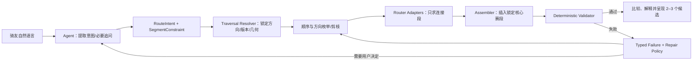

# GraphHopper / Valhalla 对 VELO「经过赛段路线规划 Agent」的启发

> 研究日期：2026-08-10
>
> 研究范围：OpenStreetMap 官网路由、GraphHopper、Valhalla，以及 VELO 当前 Rider Agent Shadow、赛段/路线几何边界和腾讯路线能力。
>
> 结论性质：架构研究与薄切实验建议，不代表已接入引擎、已验证山西路线质量或已决定生产技术栈。

## 一句话结论

这个方向值得做，但宝藏不是「OSM 会自动推荐热门骑行路线」，而是 GraphHopper / Valhalla 把**道路图、定位吸附、途经点语义、动态成本、候选路线和路径属性**拆成了可控制的原语。

VELO 应把这些原语收进自己的 Planning Domain：

1. Agent 把用户语言翻译为有版本的 `RouteIntent` 与 `SegmentConstraint`；
2. VELO 把每个“必须经过的赛段”解析成**不可变、带方向、带 entry/exit、带 geometry hash 的 Traversal**；
3. GraphHopper / Valhalla / 腾讯只计算 access、connector、exit、return；
4. VELO 将核心 Traversal 原样装入候选路线，再用确定性 Validator 证明方向、完整覆盖、连续性、硬约束和版本新鲜度；
5. Agent 只解释、比较、追问或提出放宽建议，不能自己画路，也不能把“碰到一个 waypoint”说成“完整经过赛段”。

这不是推翻 VELO 现有设计。仓库里已经有正确雏形，只是当前仍停在固定天龙山 JSON Shadow，尚未进入真实求解。

## 1. 先纠正对 OSM 官网路线规划的理解

OpenStreetMap 本身主要提供开放道路数据。OSM 官网 2015 年加入的路线界面，是调用 GraphHopper、OSRM、Valhalla 等**外部路由服务**；官网界面本身只暴露简单 A→B，且不开放各引擎的完整设置。[OSM Web front end / Routing](https://wiki.openstreetmap.org/wiki/Web_front_end/Routing)

因此，在 OSM 官网看到某条更像骑友常走的线路，最多说明：

- 当时所选引擎的自行车 profile；
- 当时的 OSM 道路、通行、路面、坡度或自行车网络标签；
- 起终点吸附到的具体道路；
- 引擎当时的成本函数；

共同产生了这个结果。它**不证明 OSM 有骑行热图，也不证明官网在多个引擎之间做了智能元路由**。

这反而带来一个更可靠的产品方向：把“本地经典赛段”和“骑友意图”作为 VELO 自己的语义与硬约束，把路网引擎当作可替换求解器。

## 2. 真正要建的不是路线聊天，而是约束编译闭环



这里的职责分界非常重要：

- **Agent 拥有语义**：理解“想骑天龙山、三小时、少走城区、从家出发再回来”。
- **Domain Plane 拥有真值与规则**：哪个天龙山 Traversal、哪个方向、哪个版本、怎样算完整经过、哪些约束不可放宽。
- **路由引擎拥有图搜索**：在给定道路图和成本模型上，找连接两个边界点的候选路径。
- **Validator 拥有最终裁决**：候选是否真的满足本次请求。

Agent 不应直接接触 raw provider API，也不应让模型从一串坐标中“肉眼判断”合格。

## 3. “经过赛段”为什么不能等同于 waypoint

### 3.1 三种方案的可靠性差异

| 做法 | 能证明什么 | 不能证明什么 | 结论 |
|---|---|---|---|
| 赛段中点作为 waypoint | 路线靠近/吸附到某个点 | 正确道路、正确方向、完整经过、不中途折返 | 不可作为产品承诺 |
| entry + exit 两个 waypoint | 路线按顺序接近两个端点 | 中间完整沿赛段、没有并行路/捷径、没有在点上 U-turn | 可用于求解提示，仍需验证 |
| 锁定 directed Traversal，外部引擎只算连接段 | 核心几何、方向、版本都不会被 provider 改写 | 连接处是否真实可骑、全程约束是否满足 | VELO 应采用，并加确定性验证 |

### 3.2 常见失败模式

1. **并行道路误吸附**：赛段点在主路、辅路、绿道或桥上下层附近，引擎吸到另一条边。
2. **途经点折返**：路线到 waypoint 后原路掉头，看似经过，实际没有沿赛段继续。
3. **端点之间走捷径**：entry 和 exit 都命中，但中间没有沿 canonical geometry。
4. **方向错误**：爬坡赛段被反向下坡穿越；端点都出现，语义完全不同。
5. **局部覆盖冒充完整覆盖**：只骑了赛段的一部分，却被文案说成“经过该赛段”。
6. **求解器静默放宽**：无可行路时吸到更远道路、改变偏好，或给出很大绕行。
7. **核心段重复**：连接段提前进入核心段，随后锁定 Traversal 再骑一次，形成回头路。
8. **图与现实不一致**：OSM 缺路、通行标签过期、路面/闸门/施工未知；算法正确也会输出错误现实结果。

因此，“必须经过赛段”是一个**后置可证明的硬约束**，不是 prompt 里的愿望。

## 4. GraphHopper 能给 VELO 什么

GraphHopper 是 Apache 2.0 的开源道路路由引擎，可作为 Java library 或独立服务运行，默认支持 OSM，并提供路线、吸附、备选路线、海拔和 path details。[GraphHopper repository](https://github.com/graphhopper/graphhopper)

### 4.1 对赛段规划最有价值的原语

- 多个 `point` 按顺序参与路线计算。
- `point_hint` 可用路名帮助选择邻近道路。
- `snap_prevention` 可避免输入点吸到 motorway、trunk、ferry、tunnel、bridge、ford 等类型；但官方文档明确说，它只控制**吸附**，并不禁止最终路线经过这些道路。
- `heading` 与 `heading_penalty` 可偏向某个出发方向。
- `pass_through=true` 会结合 heading penalty 避免在 via point U-turn；措辞是“avoid”，不是绝对的赛段覆盖保证。
- `curbside` / `curbside_strictness` 可约束点相对道路方向的一侧。
- `algorithm=alternative_route` 可输出多个候选，并控制最大数量、相对权重和路线重合比例。
- `details` 可返回 `edge_id`、`road_class`、`road_environment`、`street_name`、`average_speed` 等分段属性，便于验证和解释。

这些字段与限制见 GraphHopper 官方 [Web API documentation](https://github.com/graphhopper/graphhopper/blob/master/docs/web/api-doc.md)。

### 4.2 Custom Model 的真正价值

GraphHopper 把道路拆成 edge，通过 `speed`、`priority`、`distance_influence` 与 `turn_penalty` 形成总权重。Custom Model 可以按 `road_class`、`surface`、`road_access`、`cycleway`、`smoothness`、坡度、城区密度、自定义区域等属性调整路径偏好。[GraphHopper Custom Models](https://github.com/graphhopper/graphhopper/blob/master/docs/core/custom-models.md)

这对 VELO 很有启发，因为骑友说的：

- “少走大车多的主路”；
- “宁可远一点也要路面好”；
- “今天想爬坡”；
- “不想穿城区”；

可以被编译成可审计的成本模型，而不是只放在 Agent 文案里。

但要守住两个边界：

1. 这是**软偏好/成本函数**，不等于“必须经过某个赛段”的硬约束。
2. Custom Model 文档把该能力标为 beta，并且请求级能力与预处理加速模式存在组合限制；必须固定引擎版本、profile 版本和 model hash，不能把 `master` 行为当稳定合同。

### 4.3 GraphHopper 更适合承担的 VELO 角色

- 首个自建离线 connector adapter；
- 路面、道路等级、城区、坡度偏好的实验底座；
- 返回 path details，帮助 Validator 解释候选为什么被接受/拒绝；
- 用 alternative route 产生有限多样性，而不是让 LLM 凭空“想三条路线”。

## 5. Valhalla 能给 VELO 什么

Valhalla 是 MIT 许可的开源路由引擎，使用分层 tiles、运行时动态 costing，支持 OSM、路线、矩阵、地图匹配、海拔和多种交通模式。[Valhalla repository](https://github.com/valhalla/valhalla)；[Valhalla API overview](https://valhalla.github.io/valhalla/api/)

### 5.1 更明确的 location 语义

Valhalla 的 `Location` 思路比“所有点都是 waypoint”更接近 Agent 约束编译：

- `break`：停靠并切出 route leg；
- `through`：表达“穿过这里而不是在这里停靠/折返”，不切 leg；
- `via`：保留穿越语义，并形成 leg 边界；
- `break_through`：保留 break/leg 语义，同时表达继续向前的偏好。

官方 API 合同把 `through` 描述为不允许在点上反向；`via` 与 `break_through` 后续由 Valhalla 正式加入。但 Valhalla 的历史 changelog 也记录过 dead-end 区域可能迫使 `through` 产生 U-turn。因此这些类型应被视为比普通 waypoint 更强的**求解控制**，不能被 VELO 升格成完整赛段的硬保证。[Valhalla route API reference](https://github.com/valhalla/valhalla-docs/blob/master/turn-by-turn/api-reference.md#locations)；[Valhalla changelog](https://github.com/valhalla/valhalla/blob/master/CHANGELOG.md)

这四种类型很适合启发 VELO 自己的 `PlanLeg` 和 `TraversalBoundary` 语义，但仍不能代替完整赛段验证：`through` 只约束经过该 location 时不反向，不证明两个点之间严格走 canonical geometry。

### 5.2 吸附、骑行成本和地图匹配

Valhalla Location 支持 `heading`、`heading_tolerance`、`radius`、候选道路 ranking、reachability、side-of-street、node snap tolerance 和 search cutoff 等控制。自行车 costing 支持 `bicycle_type=Road`、`cycling_speed`、`use_roads`、`use_hills`、`avoid_bad_surfaces` 等选项。[Valhalla route API reference](https://github.com/valhalla/valhalla-docs/blob/master/turn-by-turn/api-reference.md)

Valhalla 的 Meili 会为 GPS 点寻找多个 edge candidate，用距离和网络转移成本做 HMM/Viterbi map matching，并输出有顺序的 edge segments；这对“候选路线/实际活动到底覆盖了哪个赛段边”非常有参考价值。[Valhalla Meili architecture](https://valhalla.github.io/valhalla/contributing/architecture/meili/)

重要边界：地图匹配只能回答“这串点最可能落在哪些图边”，不能回答“这是不是 VELO 认定的天龙山经典骑法”。后一个问题仍由 VELO Traversal identity、revision、direction 和 geometry hash 决定。

### 5.3 Valhalla 更适合承担的 VELO 角色

- 验证多类 location 语义对 U-turn、leg 划分和方向控制的影响；
- 用 runtime bicycle costing 生成不同骑行风格候选；
- 用 trace/map matching 做 provider-independent 的路线属性与 edge 覆盖实验；
- 作为 GraphHopper 的独立对照，暴露吸附或成本模型的不确定性。

## 6. 两个引擎怎么选：先不要把选型当结论

| 比较维度 | GraphHopper | Valhalla | 对 VELO 的判断 |
|---|---|---|---|
| 途经点/U-turn | `heading` + `pass_through` | `break/through/via/break_through` 更显式 | Valhalla 语义更丰富，但二者都不能证明完整赛段 |
| 骑行成本 | Custom Model 可组合 edge 属性与区域规则 | runtime bicycle costing 参数成熟直观 | GH 更适合表达 VELO 自定义规则；Valhalla 更适合标准骑行风格 |
| 候选解释 | path details 很直接 | trip legs、maneuvers、trace attributes | 都可用，必须归一到 VELO schema |
| 备选路线 | alternative route 参数 | alternate path 能力 | 都只能提供原料，VELO 负责去重与合格判定 |
| 地图匹配 | 有独立 map-matching 模块 | Meili 是核心组件之一 | 可做观测/验证，不是赛段真值源 |
| 许可证 | Apache 2.0 | MIT | 引擎均适合自建；OSM 数据义务另算 |
| 工程形态 | Java library / standalone server | C++ / tile service | 必须用山西真实 PBF、机器资源和更新流程实测 |

推荐不是“现在二选一”，而是：

1. 先完成 provider-neutral 的 Intent / Traversal / Candidate / Validation 合同；
2. 用 GraphHopper 做第一个 adapter spike，因为 Custom Model、path details 和独立 Web API 更适合快速暴露约束编译问题；
3. 用 Valhalla 对同一批固定输入做对照，重点看 location 类型、吸附和 map matching；
4. 只有在山西实测后，才根据覆盖、错误类型、延迟、资源、更新成本决定主引擎；另一个可以保留为 Shadow，而不是同时进入生产热路径。

如果两个引擎结果不一致，不能简单多数表决。分歧本身应成为 `routing_uncertainty`：提示道路吸附、通行标签或成本模型需要检查。

## 7. VELO 当前已经具备什么

### 7.1 已有正确骨架

当前 TypeScript Rider Planning 已定义：

- `PlanLeg.role = access | connector | core | exit | return`；
- `source_adapter = canonical_traversal | tencent_bicycling`；
- `CoreTraversal` 固定 `traversal_ref + revision + geometry_hash + start_ref + end_ref`；
- Candidate 固定 request hash、origin revision、world revision。

见 [`agent_runtime/consumer/planning/types.ts`](../../agent_runtime/consumer/planning/types.ts)。

Shadow Validator 已经拒绝：

- 旧请求、旧起点或旧世界版本；
- 超时、超爬升、城区暴露越界、仍有 unknown；
- 路线腿不连续或不能返回起点；
- 没有核心赛段；
- 腾讯重算/伪装核心赛段；
- core 的 revision、hash、entry、exit 与已发布 Traversal 不一致。

见 [`agent_runtime/consumer/planning/shadow.ts`](../../agent_runtime/consumer/planning/shadow.ts)。这证明 VELO 已经做对了最关键的所有权边界。

### 7.2 当前仍是假的地方

天龙山候选来自 [`tests/fixtures/ride_planning/tianlongshan_world.json`](../../tests/fixtures/ride_planning/tianlongshan_world.json)：三个 candidate plan 和腾讯 path 都是预制 ref/hash，没有真实 provider geometry。

Runtime README 也明确：当前没有真实模型、腾讯网络、生产数据库流量或小程序接入，decision model 是 deterministic fake。[`agent_runtime/README.md`](../../agent_runtime/README.md)

当前腾讯骑行客户端只有起点、终点，固定取 `routes[0]`；不支持途经点、方向、候选路线或 path details。[`app/route_book/tencent_direction.py`](../../app/route_book/tencent_direction.py)

手画贴路已经有一个值得复用的模式：把草稿抽稀成多个 anchor，相邻 anchor 分段求路，再拼接，并识别局部巨大绕行。[`app/route_book/draw_snap_service.py`](../../app/route_book/draw_snap_service.py) 但它服务的是用户手画预览，不是 Rider Agent 规划。

### 7.3 数据层不能偷换

当前 `segments.reference_line` 是正式赛段几何；`route_versions.reference_line_snapshot` 是完整路线几何快照；`route_segments` 是正式路线组件解释，不是草稿路线真值，也不保存一次性 connector。

现有数据库边界已经明确：首版 Traversal 可锚定经审核的 `(segment_id, geometry_hash)`，但通用方向、裁切和跨路线身份仍需未来 Traversal 表族；未来 `ride_plan_legs.core` 必须引用 immutable Traversal，provider 只产生连接段。[`agent_runtime/DATABASE_BOUNDARY.md`](../../agent_runtime/DATABASE_BOUNDARY.md)

因此本轮实验**不应先加数据库表**。先证明合同、求解和验证闭环，越过实验门槛后再设计持久化。

## 8. 推荐的 VELO 规划合同

下面是概念合同，不是现在就要照抄的 schema：

```text
RouteIntent
  origin / return_policy
  required_traversals[]
  hard_limits: time, climb, accessibility, complete_coverage
  soft_preferences: urban_exposure, surface, hills, road_comfort
  intent_hash / world_revision

SegmentConstraint
  traversal_ref
  traversal_revision
  geometry_hash
  entry_ref / exit_ref
  required_direction
  coverage_policy = exact_locked_core
  strictness = hard

ConnectorRequest
  from_boundary / to_boundary
  heading / snap constraints
  cost_profile_ref + profile_hash
  avoid areas/edges
  alternative budget

CandidatePlan
  ordered legs[]
  provider observations[]
  metrics / unknowns / warnings
  request_hash / world_revision

ValidationReport
  rule_id / verdict / evidence_ref
  core hash and direction
  connector continuity
  duplicate/backtrack detection
  hard-limit fit
  freshness / provider provenance

RepairDirective
  retry_same_engine_with_tighter_snap
  split_connector
  switch_adapter
  reorder_traversals
  ask_user_to_relax
  no_result
```

### 8.1 多赛段规划不应交给 LLM 猜顺序

当用户要求经过多个赛段时，每个赛段是带方向的 entry→exit 对。Planning service 可：

1. 用 matrix/粗成本估算 origin、各 entry/exit、return 之间的连接成本；
2. 对少量赛段枚举合法顺序与允许方向；
3. 先剪掉必然超时、超爬升或不连通的组合；
4. 再向 router 请求精确 connectors；
5. 装入 locked cores 后统一验证与排序。

LLM 可以根据“训练目的/风景/先难后易”提出排序偏好，但不负责计算可达性和几何。

## 9. Validator 必须证明什么

### 9.1 硬门禁

- 每个 required Traversal 恰好出现于合法位置，revision/hash 完全匹配。
- 按 entry→exit 的方向出现，不能以反向或只覆盖部分代替。
- core geometry 原样保留；provider 路径不能重写 core。
- 相邻 leg 在坐标和拓扑上连续，没有不可骑的直线跳接。
- connector 不应提前重复覆盖 core，也不能造成明显折返/U-turn。
- 时间、总爬升、距离或用户明确的禁行条件满足；无法计算则进入 unknown，不得按通过处理。
- candidate 绑定当前 intent、origin、world、router dataset/profile/version；任一变化后旧结果 stale。

### 9.2 赛段覆盖验证如何复用现有能力

VELO 现有 activity matcher 已经按“先命中起点、再从后续点命中终点、再检查参考线覆盖率”保证方向，并防止起终点之间抄近路。[`app/segment/matcher.py`](../../app/segment/matcher.py)

可以复用它的**裁判思想**，但不能直接复用当前 80% 活动匹配阈值作为规划标准：

- 活动轨迹有 GPS 漂移和采样缺失，需要容差；
- 规划结果是系统生成的，core 应直接引用 exact geometry/hash，不需要容忍静默缺失；
- connector 与 core 的接缝阈值应由山西真实道路样本校准，而不是现在拍一个米数。

### 9.3 软排序

通过硬门禁后，再按这些因素排序：

- 城区/大车道路暴露；
- 不良路面、闸门、无照明、隧道等风险证据；
- 用户时间与爬升目标的贴合程度；
- 连接段长度与无意义折返；
- 候选之间的实质差异；
- 数据新鲜度与 provider 分歧。

硬约束不能用加权总分“抵消”。少经过一个必选赛段，不能因为风景分高就排第一。

## 10. 失败后怎么修，而不是让 Agent 圆回来

| 失败 | 确定性修复动作 | 仍失败时对用户怎么说 |
|---|---|---|
| 吸到并行路/桥上下层 | 收紧 radius；加入 heading、road hint、snap filter；比较 snapped waypoint/edge | “入口附近道路有歧义，需要你确认入口或换一个接入点” |
| waypoint 处 U-turn | GraphHopper `pass_through` / Valhalla `through` 或 `break_through`；必要时拆成独立 connector | “当前路网无法在不折返的情况下按该方向接入” |
| entry/exit 命中但中间未覆盖 | 直接拒绝；改用 locked core assembly | 不能呈现为“经过赛段” |
| connector 与 core 有空隙 | 尝试相邻合法接入边界；验证拓扑 | “赛段入口与可规划道路没有可靠连接” |
| 总时间/爬升超限 | 换顺序、减少 connector、比较备选 | 明确列出冲突，只能由用户选择放宽时间/爬升或减少赛段 |
| OSM 缺路或 access 不可信 | 切腾讯/人工已验 provider；保留 data gap | “道路数据不足，暂不能可靠生成”而不是画直线补上 |
| 两引擎强分歧 | 标记 uncertainty，检查 snap、道路标签和 profile | 可呈现差异，但不自动投票选一个 |
| world/profile/PBF 更新 | 旧 candidate stale，重新生成 | 不复用旧几何冒充当前结果 |

这些失败可落到 VELO 已有的 typed `NO_RESULT`：`no_viable_plan`、`hard_constraint_conflict`、`insufficient_information`、`data_unavailable`，并给出 `clarify_intent`、`relax_constraint`、`choose_other_area`、`try_later` 等下一步。[`contracts/agent_v0/agent_action.schema.json`](../../contracts/agent_v0/agent_action.schema.json)

## 11. 建议先做的山西离线薄切实验

### 11.1 实验目的

不是比较谁的路线“看着更顺眼”，而是回答四个问题：

1. VELO 能否可靠保证按方向完整经过指定赛段？
2. 哪些失败能靠 provider 参数修，哪些必须靠 locked Traversal？
3. GraphHopper 与 Valhalla 在山西的主要误差来自算法、吸附，还是 OSM 道路数据？
4. 能否把失败稳定翻译成 Agent 可解释、可修复、不可吹嘘的 typed result？

### 11.2 固定输入

- 同一份带时间戳和 checksum 的山西 OSM PBF；
- 同一组 canonical Traversal geometry/revision/hash；
- 先选一条方向性强、已人工确认的天龙山爬坡赛段；
- 至少三个起点：容易接入、并行道路易误吸附、路网可能不连通；
- 再加入一个双岸/平行道路歧义明显的汾河样本；
- 固定两引擎版本、配置、profile/model hash 和海拔来源。

### 11.3 三组方法对照

对每个 case 都跑：

1. `midpoint waypoint`；
2. `entry + exit + provider pass-through semantics`；
3. `locked core + provider connectors`。

GraphHopper 和 Valhalla 使用相同 RouteIntent，adapter 只负责翻译，不给 Agent 暴露 provider-specific JSON。

### 11.4 记录指标

- required Traversal 完整覆盖与方向正确率；
- entry/exit snapped edge、吸附距离与歧义候选；
- connector-core 接缝、重复覆盖、U-turn、backtrack；
- 总距离、预计时间、总爬升和各类道路暴露；
- 候选数量、实质去重后数量、无解率；
- 两引擎分歧类型；
- PBF/profile 更新前后的结果稳定性；
- 冷启动、热请求延迟、内存、tile/graph 构建时间与磁盘占用；
- 每次接受/拒绝可否给出 rule-level evidence。

阈值先由样本分布和人工地图检查校准，不能在研究文档里凭空定“20 米即安全”之类标准。

### 11.5 实验通过条件

- 方法 3 对已知可达 case 能稳定保留 exact core hash 和方向；
- 所有方法对不可达/不确定 case 都不能静默删掉赛段或画直线；
- Validator 能挡住 midpoint/entry-exit 的伪通过；
- 同一固定输入可重放，输出携带 engine、dataset、profile、request 和 world provenance；
- 失败可归入有限 typed reasons，并能区分重试、换 adapter、问用户和 no-result；
- 人工地图审查确认的不合理路线能对应到可观测证据，而不是只有“感觉不好”。

### 11.6 首刀不做什么

- 不接生产 Rider Agent；
- 不改小程序、不做实时导航或动态改路；
- 不先新增 Rider/Traversal 数据库表；
- 不把 OSM relation、route heat 或 engine preference 当 VELO 热门度；
- 不让 Agent 直接生成/修改 canonical geometry；
- 不同时运维两个生产引擎；
- 不因单个天龙山 demo 成功就宣布山西可用。

## 12. 产品与数据边界

### 12.1 这仍符合 VELO 的产品边界

产物是静态候选路线、风险/取舍解释与 GPX/export 准备，不是骑行中的实时导航和动态重规划。骑友得到的是“为什么这条路线会完整经过这些赛段、哪里仍有未知”，而不是一个通用地图 App。

它也能反哺社交：路线可引用正式赛段身份，骑后 Activity 可验证实际完成，骑友能围绕同一 Traversal 比较经历，而不是只分享一条没有语义的 polyline。

### 12.2 OSM 覆盖仍是硬上限

GraphHopper/Valhalla 不会把缺失道路变出来，也不会自动知道中国本地骑友的经典骑法。VELO canonical Traversal、自有/授权活动证据、人工审核与 provider fallback 仍是核心资产。

### 12.3 许可证不是“引擎开源就随便用”

GraphHopper 是 Apache 2.0，Valhalla 是 MIT；但 OSM 数据本身按 ODbL 提供，要求 OpenStreetMap attribution，并对分发修改/派生数据库存在相应义务。[OpenStreetMap Copyright and License](https://www.openstreetmap.org/copyright)

实验阶段就应记录 PBF 来源、下载时间、checksum、引擎/profile 版本和 attribution；上线前再对 VELO 加工后的道路图、缓存、导出与展示方式做具体许可审查。

## 13. 最终推荐

这个专题对 VELO 的价值很高，理由不是“多一个开源地图”，而是它为未来 Rider Agent 补上了一个清晰的计算层：

> **Agent 负责把人话变成约束；GraphHopper/Valhalla 负责搜索；VELO Traversal 负责核心赛段真值；Validator 负责证明没有撒谎。**

明确推荐下一步只做一个离线 spike：

1. 把现有天龙山 Shadow 的预制 candidate generation 替换成 provider-neutral 实验接口；
2. 保留现有 `canonical_traversal` locked-core Validator；
3. 先接 GraphHopper connector adapter，产出 geometry + snapped waypoints + path details；
4. 再用 Valhalla 跑同一 corpus 作 Shadow 对照；
5. 用 midpoint / entry-exit / locked-core 三组结果证明边界；
6. 实验通过后，再决定 Traversal 持久化、主引擎、生产资源与小程序呈现。

如果这个 spike 失败，也很有价值：它会明确告诉 VELO，山西当前瓶颈是 OSM 路网、canonical entry/exit、吸附控制还是成本模型，而不是继续让 Agent 用漂亮文案掩盖路线不可靠。
