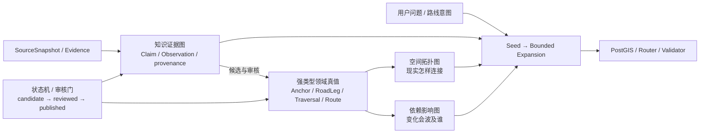

# Graphify / code-review-graph × Reborn × VELO：图索引、状态机与路线世界模型联立研究

> 研究日期：2026-08-10  
> 研究对象：[`Graphify-Labs/graphify`](https://github.com/Graphify-Labs/graphify) 与 [`tirth8205/code-review-graph`](https://github.com/tirth8205/code-review-graph)  
> 版本固定：Graphify 默认分支 `v8` @ [`10ad921b423b767dd8a947bbf0fbcc2e95038ad3`](https://github.com/Graphify-Labs/graphify/tree/10ad921b423b767dd8a947bbf0fbcc2e95038ad3)；code-review-graph `main` @ [`1a010deed6c283d4aa1e7e949e78fe3a7bcdfbb3`](https://github.com/tirth8205/code-review-graph/tree/1a010deed6c283d4aa1e7e949e78fe3a7bcdfbb3)  
> 证据边界：本文只把官方仓库、源码和测试当作项目事实；节目讲解、第三方介绍和我们的类比只作为待联立材料，不反向替代源码事实。

## 一句话结论

Graphify 真正值得 VELO 学的，不是“万物都塞进知识图谱”，而是四个更严格的机制：

1. **先把对象和关系显式化**：节点不只是文本块，边也不是无名相似度；方向、关系类型、来源位置和推断置信度都是可查询数据。
2. **检索先找种子，再做有界展开**：问题只激活少量节点，并沿允许的关系走有限跳，形成 answer-shaped subgraph，而不是把整个语料或整个路网交给模型。
3. **来源变化按贡献者替换**：重采一个文件时，只替换该来源、该提取层的旧贡献；删除、排除和失败各走不同机械门，避免旧边永久残留或部分结果覆盖完整结果。
4. **影响不是“能到达就一样重要”**：code-review-graph 用关系类型权重、关系方向、逐跳衰减和分数下限，计算每个对象的最佳影响路径。

对 VELO 最合适的落点是：**PostGIS 继续持有道路几何与版本真值，在它上面增加一个有来源、可增量重建、可有界遍历的路线认知图索引。** 不应把 Graphify 的 NetworkX JSON、社区聚类或最少跳数路径直接拿来当骑行路由引擎。

## 1. Graphify 实际存的是什么

### 1.1 节点、边和超边

Graphify 的语义提取合同包含三类结构：

- 节点：`id`、`label`、`file_type`、`source_file`、`source_location`，并可带 `source_url`、`captured_at`、`author`、`contributor`；
- 有向边：`source`、`target`、`relation`、`confidence`、`confidence_score`、`source_file`、`source_location`、`weight`；
- 超边：把三个及以上节点作为一个有名称、有关系和来源的群组保存，但没有成员顺序语义。

语义提取 prompt 明确规定边方向是“行动者 → 被作用对象”，例如调用者 → 被调用者、导入者 → 被导入对象、子类 → 基类；同时限制超边每个 chunk 最多三个，避免把任意共现都包装成群组。[语义提取合同](https://github.com/Graphify-Labs/graphify/blob/10ad921b423b767dd8a947bbf0fbcc2e95038ad3/graphify/llm.py#L450-L478)

代码 AST 层则直接构造同形数据：节点有文件和行号，边有关系、置信标签、关系发生的文件/行号和权重；直接语法事实默认 `EXTRACTED`。[AST 节点与边构造](https://github.com/Graphify-Labs/graphify/blob/10ad921b423b767dd8a947bbf0fbcc2e95038ad3/graphify/extractors/engine.py#L2644-L2684)

节点 ID 不是数据库自增键，而是对路径和符号做 Unicode 归一化、标点折叠与 casefold 后得到的确定性字符串。源码注释直说：AST、语义 Agent、图构建器三个生产者必须使用同一规则，否则同一个实体会裂成彼此不相连的 ghost nodes。[ID 归一化](https://github.com/Graphify-Labs/graphify/blob/10ad921b423b767dd8a947bbf0fbcc2e95038ad3/graphify/ids.py#L1-L50)

### 1.2 这不是“所有东西都是节点”

Graphify 仍然保留不同层次的结构：文件、类、函数、概念可以是节点；`calls`、`imports`、`references` 等是边；三个以上对象共同参与但无法由成对关系表达时才使用超边。它没有把每一条边再次升格成节点。

这点对 VELO 很重要：

- 道路交叉点、出入口和有意义的停靠锚点适合作为节点；
- 相邻锚点之间可以骑行的 RoadLeg 天然更像带属性的有向边；
- 一条 Traversal 是**有序边序列**，不是 Graphify 式无序超边；
- 一次完整 Route 又是 Traversal/Leg/custom geometry 的有序组合。

因此，“使用图论”不等于把 `Way`、`Leg`、`Traversal`、`Route` 全部拍平成同一种 node。

### 1.3 当前存储实现有一个不能照搬的限制

`build_from_json()` 默认构建 `nx.Graph`，只有显式 `directed=True` 才是 `nx.DiGraph`；为兼容无向存储，它额外用 `_src/_tgt` 保存原始方向，再在导出时恢复。默认图也不是 `MultiGraph`，同一对节点间的多种平行关系存在折叠风险。[图构建模式](https://github.com/Graphify-Labs/graphify/blob/10ad921b423b767dd8a947bbf0fbcc2e95038ad3/graphify/build.py#L741-L748) [方向恢复](https://github.com/Graphify-Labs/graphify/blob/10ad921b423b767dd8a947bbf0fbcc2e95038ad3/graphify/export.py#L289-L313)

道路世界恰好高度依赖方向和平行边：同两锚点间可能同时有机动车道、绿道、辅路、桥上和桥下，也可能有不同通行条件。VELO 不能沿用这个默认；道路拓扑至少需要一个有稳定 edge identity 的 directed multigraph，或在关系数据库里用 `road_legs` 表显式承担这一职责。

## 2. 摄取、解析与来源溯源

### 2.1 两条事实生产线

Graphify 对代码与非代码材料采取不同生产线：

- 代码主要由 tree-sitter AST 在本地确定性提取结构；
- 文档、论文、图片、转录材料由模型做语义提取；
- 最终合并成同一种节点/边合同，再聚类、分析和导出。

官方说明明确说，纯代码语料不会进入普通的语义提取流程；文档/媒体语义层会调用配置的模型。[三遍处理流程](https://github.com/Graphify-Labs/graphify/blob/10ad921b423b767dd8a947bbf0fbcc2e95038ad3/docs/how-it-works.md#L3-L18)

这不是“模型读一切”，而是先尽量用确定性解析拿事实，再把模型限制在无法由语法直接得出的概念关系上。

### 2.2 溯源字段的真实边界

Graphify 的每条关系可以落回关系发生的 `source_file/source_location`，并用 `EXTRACTED / INFERRED / AMBIGUOUS` 区分事实层级。URL 摄取时，网页、Tweet 和 arXiv 会先保存成带 `source_url`、`captured_at`、`author/contributor` 等 YAML frontmatter 的本地 Markdown；语义提取规则要求把这些字段复制到该文件产生的节点上。[URL 摄取元数据](https://github.com/Graphify-Labs/graphify/blob/10ad921b423b767dd8a947bbf0fbcc2e95038ad3/graphify/ingest.py#L103-L207) [frontmatter 传播规则](https://github.com/Graphify-Labs/graphify/blob/10ad921b423b767dd8a947bbf0fbcc2e95038ad3/graphify/skills/codex/references/extraction-spec.md#L12-L30)

它还有一层有限的 evidence binding：如果语义模型从文档中声称一个 `file_type=code` 的符号，但符号名在模型实际看到的源文本里没有任何可核对字面证据，系统只把节点标成 `verification="unverified"`，不会直接删除。[语义节点证据绑定](https://github.com/Graphify-Labs/graphify/blob/10ad921b423b767dd8a947bbf0fbcc2e95038ad3/graphify/llm.py#L599-L718)

这是一种有用但有限的溯源：

- 它能回答“这条边从哪个文件、哪一行产生，是直接抽取还是推断”；
- 它不能证明推断在现实世界为真；
- evidence binding 只覆盖一种特殊的语义代码节点，不是对所有概念边的事实核验；
- `confidence_score` 是提取者给关系的证据等级，不是统计校准后的真实概率。

所以迁移到 VELO 时，`Strava EXTRACTED` 也只能表示“Strava 页面明确这样写”，不能表示“现实海拔、道路位置必然正确”。用户刚发现的 Strava 赛段爬升漂移，正是“忠实抽取来源”和“来源本身可靠”必须分开的例子。

## 3. 增量更新：机械门比“记得刷新”更重要

Graphify 的增量设计不是简单 append：

1. manifest 分开保存 AST 与 semantic 两套 hash，使 AST-only 更新不能冒充语义层也已刷新；
2. mtime 没变时快速判定，mtime 变化时再用内容 hash 确认，避免仅触碰文件就重提取；
3. 重提取文件会按 `source_file + producer tier` 替换旧贡献，AST 和 semantic 两层可以共存且互不误删；
4. 真删除、仍存在但被 ignore/exclude、以及现有图中已经失去来源的 stale source 被分开处理；
5. 当提取不完整且新图比旧图更小时，默认拒绝覆盖，并且不写“已完成”的 manifest；只有显式 `--allow-partial` 才越过保护。

相关真实路径见：[增量检测合同](https://github.com/Graphify-Labs/graphify/blob/10ad921b423b767dd8a947bbf0fbcc2e95038ad3/graphify/detect.py#L1900-L2021)、[按来源和生产层替换](https://github.com/Graphify-Labs/graphify/blob/10ad921b423b767dd8a947bbf0fbcc2e95038ad3/graphify/build.py#L1547-L1653)、[部分结果拒绝覆盖](https://github.com/Graphify-Labs/graphify/blob/10ad921b423b767dd8a947bbf0fbcc2e95038ad3/graphify/cli.py#L3906-L3943)。

对 VELO 的直接启发不是照搬文件 manifest，而是给每批来源一个 `SourceSnapshot`：

```text
Strava segment snapshot
Tencent planned geometry snapshot
DEM elevation snapshot
Tim manual correction snapshot
```

每个来源只拥有自己生成的 `Observation/Claim/DerivedArtifact`。新快照到来时替换该来源的贡献，不能直接覆盖人工审核后的 canonical Way/Anchor/Traversal；而是使受影响派生对象进入重新计算或审核队列。这样才能避免“Strava 改了标题/轨迹，所以我们把 Tim 已校正的路也跟着重置”。

## 4. Graphify 的查询与打分究竟如何工作

### 4.1 不是向量召回，而是词法选种子

`query_graph` 的第一步会把问题拆词，并在节点 label、node id 和 `source_file` 上打分：

- exact、prefix、substring 和 source-file 命中分层计分；
- IDF 降低高频词权重；
- 多词查询按词覆盖率平方压低只命中一个常见词的节点；
- trigram 倒排只做候选预过滤，最终仍执行同一套精确词法判定；
- 同分时再以图 degree、标签长度和 node id 做稳定决胜。

实现见 [IDF 与 trigram 候选](https://github.com/Graphify-Labs/graphify/blob/10ad921b423b767dd8a947bbf0fbcc2e95038ad3/graphify/serve.py#L280-L409) 和 [查询节点打分](https://github.com/Graphify-Labs/graphify/blob/10ad921b423b767dd8a947bbf0fbcc2e95038ad3/graphify/serve.py#L428-L606)。

因此，Graphify 所谓 plain-language query 的“语义”主要来自**已经进入图中的概念节点和语义边**，不是查询时把自然语言编码成向量后做最近邻。若问题用词和图中标签完全不同，又没有对应语义边或别名节点，它仍可能找不到正确种子。

### 4.2 从种子做有界遍历

选出少量 seed 后，系统才做 BFS/DFS：

- query 默认深度 3，工具入口把深度限制在最多 6；
- 非 seed 的超高 degree hub 不再被继续展开，防止一个公共工具节点把全图带进结果；
- 返回的是 visited nodes 的诱导子图，并受输出 token budget 限制；
- shortest path 默认遵守存储方向，默认最多 8 hop，超过就拒绝返回。

实现见 [BFS/DFS 与 hub 截断](https://github.com/Graphify-Labs/graphify/blob/10ad921b423b767dd8a947bbf0fbcc2e95038ad3/graphify/serve.py#L851-L956)、[query 主流程](https://github.com/Graphify-Labs/graphify/blob/10ad921b423b767dd8a947bbf0fbcc2e95038ad3/graphify/serve.py#L1114-L1161) 和 [有向 shortest path](https://github.com/Graphify-Labs/graphify/blob/10ad921b423b767dd8a947bbf0fbcc2e95038ad3/graphify/serve.py#L1275-L1373)。

这套结构适合回答“与天龙山半程终点相关的 POI、赛段、路线和来源是什么”，但不适合直接回答“从家到天龙山怎样骑最舒服”。后者需要距离、坡度、路面、通行、转向和道路等级成本，不是 hop 数。

### 4.3 社区和 god nodes 是观察工具，不是分类真值

Graphify 用 Leiden 做社区发现，缺少可选依赖时退化为 NetworkX Louvain；聚类基于拓扑边密度，不需要 embedding。源码还会把过大或低 cohesion 的社区再次拆分，并可先排除超级 hub 后再按邻居多数票挂回。[社区发现实现](https://github.com/Graphify-Labs/graphify/blob/10ad921b423b767dd8a947bbf0fbcc2e95038ad3/graphify/cluster.py#L22-L77) [社区拆分和 hub 处理](https://github.com/Graphify-Labs/graphify/blob/10ad921b423b767dd8a947bbf0fbcc2e95038ad3/graphify/cluster.py#L134-L236)

`god_nodes` 本质上是排噪后的高 degree 节点；“surprising connections”则根据推断等级、跨文件类型、跨目录、跨社区和 peripheral→hub 等启发式加分。[surprise score](https://github.com/Graphify-Labs/graphify/blob/10ad921b423b767dd8a947bbf0fbcc2e95038ad3/graphify/analyze.py#L203-L274)

这些结果适合发现候选结构，不适合成为领域分类：增加几个热门路线或公共入口后，社区边界就可能变化。VELO 可以用社区发现提示“汾河走廊群”“西山爬坡群”，但不能据此决定 Way 的正式父子关系或把一个 POI 自动升格为赛段终点。

## 5. 它与向量检索、RAG、语义搜索的真实关系

| 机制 | Graphify 当前实现 | 典型向量检索 / RAG | 对 VELO 的位置 |
|---|---|---|---|
| 索引单元 | 实体节点、带类型有向边、可选超边 | 文本 chunk + embedding | 道路/锚点/Traversal 用图；POI 叙述可另做文本索引 |
| 查询召回 | label/id/source 的词法打分选 seed | query embedding 最近邻 | 地名别名和精确对象先词法/结构；模糊体验描述可用向量 |
| 上下文扩展 | 沿边有限跳遍历 | 取 top-k chunk，可选 rerank | 沿 `HAS_ANCHOR/USES_LEG/NEAR_POI` 等允许关系展开 |
| 解释性 | 可以输出每一跳关系、方向、来源与置信度 | 相似度能解释“近”，较难解释因果路径 | 产品解释应引用具体 Way/Anchor/Observation 路径 |
| 原文保真 | 图是压缩后的结构，不保证保存完整论证 | chunk 能直接把原文交给生成模型 | 路线指南、封路公告仍需回源，图不能代替原文 |
| 弱点 | 标签失配、错误边传播、图构建成本 | 相似但无关、切块断裂、缺少关系约束 | 两者互补，均不能成为几何真值 |

Graphify 官方明确宣传“不使用 embedding / vector store”，依赖已经抽取出的 `semantically_similar_to` 边影响图结构和社区。[官方处理说明](https://github.com/Graphify-Labs/graphify/blob/10ad921b423b767dd8a947bbf0fbcc2e95038ad3/docs/how-it-works.md#L21-L31) 这不等于它没有语义处理：文档/媒体进入图前已经由模型完成语义压缩，只是查询阶段不再计算向量。

code-review-graph 则证明图和向量根本不是二选一：它的搜索同时运行 SQLite FTS5/BM25 与 embedding search，用 Reciprocal Rank Fusion 合并；embedding 不可用时退回 FTS，再退到 LIKE。[混合检索实现](https://github.com/tirth8205/code-review-graph/blob/1a010deed6c283d4aa1e7e949e78fe3a7bcdfbb3/code_review_graph/search.py#L315-L390) 本地默认 embedding provider 是 `all-MiniLM-L6-v2`，也支持显式配置云端 provider。[embedding provider](https://github.com/tirth8205/code-review-graph/blob/1a010deed6c283d4aa1e7e949e78fe3a7bcdfbb3/code_review_graph/embeddings.py#L1-L10) [本地默认模型](https://github.com/tirth8205/code-review-graph/blob/1a010deed6c283d4aa1e7e949e78fe3a7bcdfbb3/code_review_graph/embeddings.py#L68-L79)

对 VELO 最稳妥的组合是：

```text
精确对象/别名/空间范围找 seed
          ↓
按允许关系有界展开认知子图
          ↓
PostGIS / 路由引擎计算真实空间路径
          ↓
必要时用向量召回 POI 描述、骑友体验和历史说明
          ↓
确定性 Validator 裁决方向、覆盖和版本
```

向量检索负责“用户说的感觉像什么”，图负责“对象之间怎样连接”，PostGIS/路由引擎负责“现实中能否这样走”。

## 6. code-review-graph 的 impact / affected area / 逐跳权重

### 6.1 `affected area` 不是一个持久化实体

源码中没有独立的 `AffectedArea` 节点或表。影响范围是一次查询的派生结果：

- `changed_nodes`：变更文件中的全部节点；
- `impacted_nodes`：沿允许关系传播后到达的节点；
- `impacted_files`：这些节点所在文件；
- `edges`：结果对象之间的相关边；
- `impact_scores`：每个影响节点的最佳路径得分；
- 流程层另有 `affected_flows`，根据 changed file 的 node membership 反查 flow，再按 criticality 排序。[affected flow 派生](https://github.com/tirth8205/code-review-graph/blob/1a010deed6c283d4aa1e7e949e78fe3a7bcdfbb3/code_review_graph/flows.py#L678-L718)

节点/边自身存 SQLite，并保留 qualified identity、文件、行号、关系类型和置信度。[SQLite 图 schema](https://github.com/tirth8205/code-review-graph/blob/1a010deed6c283d4aa1e7e949e78fe3a7bcdfbb3/code_review_graph/graph.py#L70-L152)

这正适合迁移成 VELO 的思路：`天龙山道路几何修订影响范围` 不必先建成永久对象，而可以从受影响的 Leg/Anchor 出发，当场计算需要重算的 Traversal、RouteVersion、海拔摘要、Guide 和审核任务。

### 6.2 传播方向不是简单沿箭头向外

依赖边通常存为“依赖者 → 被依赖者”，所以被依赖对象变化时，影响要逆着存储边传播到调用者、继承者、引用者和 importer。`TESTED_BY` 则特意存为生产对象 → 测试，因此沿正向传播。`CONTAINS` 不参与影响扩张，因为变更文件中的全部节点已经是 seed，继续走 containment 可能借 stale edge 桥接到无关对象。[方向策略与理由](https://github.com/tirth8205/code-review-graph/blob/1a010deed6c283d4aa1e7e949e78fe3a7bcdfbb3/code_review_graph/constants.py#L70-L92)

这提醒 VELO：边的“阅读方向”和“影响传播方向”是两件事。例如：

```text
RouteVersion --USES_TRAVERSAL--> Traversal
```

读取关系时路线指向所用 Traversal；当 Traversal 变更时，影响传播却要反向找到 RouteVersion。

### 6.3 最佳路径分数

默认权重为：

| 关系 | 权重 |
|---|---:|
| `CALLS` | 1.0 |
| `INHERITS / OVERRIDES / IMPLEMENTS` | 0.9 |
| `TESTED_BY` | 0.7 |
| `REFERENCES / DEPENDS_ON` | 0.6 |
| `IMPORTS_FROM` | 0.5 |
| `CONTAINS` | 0.3，但不参与传播 |
| 未知关系 | 0.5 |

每一跳再乘默认深度衰减 `0.6`，分数不高于现有最佳路径才不再更新，低于或等于 `0.05` 则停止扩张；默认最多 2 跳、500 个结果。[权重、衰减和边界](https://github.com/tirth8205/code-review-graph/blob/1a010deed6c283d4aa1e7e949e78fe3a7bcdfbb3/code_review_graph/constants.py#L40-L99)

因此从变更 seed 出发：

```text
一跳 CALLS        = 1.0 × 0.6 = 0.60
两跳 CALLS        = 1.0 × 0.6 × 1.0 × 0.6 = 0.36
一跳 IMPORTS_FROM = 1.0 × 0.5 × 0.6 = 0.30
```

源码默认使用 SQLite 的有界 best-score relaxation：每轮只保留每个 endpoint 的最高分，而不是在有环稠密图里枚举指数级路径；也保留 NetworkX 实现作为对照。[SQL 最佳路径松弛](https://github.com/tirth8205/code-review-graph/blob/1a010deed6c283d4aa1e7e949e78fe3a7bcdfbb3/code_review_graph/graph.py#L1389-L1500) [NetworkX 对照实现](https://github.com/tirth8205/code-review-graph/blob/1a010deed6c283d4aa1e7e949e78fe3a7bcdfbb3/code_review_graph/graph.py#L1564-L1603)

官方测试明确锁住了 `0.60 / 0.36 / 0.30` 的排序，并要求 SQL 与 NetworkX 两个引擎结果一致；还验证更深但更强的路径可以胜过更浅的弱路径。[逐跳权重测试](https://github.com/tirth8205/code-review-graph/blob/1a010deed6c283d4aa1e7e949e78fe3a7bcdfbb3/tests/test_graph.py#L897-L958)

### 6.4 `impact_score` 不等于风险、热度或推荐分

这个分数表达的是“从本次变更沿结构依赖传播的相对强度”。它不是：

- 代码错误概率；
- 节点本身重要度；
- 社区热度；
- 用户偏好；
- 路线成本或推荐质量。

同理，VELO 可以用类似分数排序“某条 Leg 变更后最应该先复核哪些对象”，但绝不能把它直接解释为“这条路线更热门/更适合骑”。领域目标不同，权重必须重新定义并用真实历史变更校准。

## 7. 可以迁移到 VELO 的机制

### 7.1 两个相互协作、但真值责任不同的图面

建议把“图”拆成两个视角，而不是建一个万能知识图谱：

#### A. 空间拓扑图：现实怎样连接

```text
Anchor ──RoadLeg──> Anchor
```

RoadLeg 必须有稳定 identity，并携带：direction、geometry/version、长度、海拔剖面、累计爬升/下降、surface、access、source/review 状态。这个层由 PostGIS 持有真值。

#### B. 路线认知图：人为什么这样命名、停留、组合和信任

```text
WayContext --HAS_ANCHOR--> Anchor
Traversal  --USES_LEG--> RoadLeg（另存有序 membership）
Traversal  --STARTS_AT / ENDS_AT--> Anchor
RouteVersion --USES_TRAVERSAL--> Traversal
POI --LOCATED_AT / NEAR--> Anchor 或 RoadLeg measure
Observation --SUPPORTS / CONTRADICTS--> 上述对象或字段声明
SourceSnapshot --PRODUCED--> Observation
```

认知图可以用 SQL 关系表、递归 CTE 或派生 NetworkX 视图实现，不要求现在引入 Neo4j。关键是关系类型、方向、来源和版本先进入领域合同。

### 7.2 三个真实案例怎样落下

#### 偏桥沟

- 一套物理 RoadLeg/geometry；
- 两个有方向的 Traversal；
- 下坡 Traversal 的 leg order 和 direction 是上坡的 reverse；
- PR/排行榜仍按 Traversal 分开；
- 反向不是把 `elevation_gain` 变负，而是重新汇总反向剖面，gain/loss 交换、净高差与坡度符号变化。

这里学 Graphify 的是“关系方向显式、底层事实不重复”，不是它默认无向图的兼容做法。

#### 天龙山半程

- 半程与全程共享部分 RoadLeg；
- 半程终点绑定一个 typed Anchor；
- Anchor 可以是 `poi / access_gate / junction / regroup / training_boundary / observed_turnaround`，不能预设所有折返点都是 POI；
- `半程 IS_GEOMETRIC_SUBPATH_OF 全程` 可作为派生关系；
- “为什么人愿意停在这里”来自 POI/Observation/Guide 的证据，不塞进几何包含关系。

这对应 Graphify 的核心启发：边要说明“是什么关系”，不能把空间包含、用户动机和内容叙事都压成一个 `child_segment`。

#### 汾河自行车道

- 用 directed multigraph 表达两岸、桥梁、出入口和岔路；
- 相邻 Anchor 之间保存原子 RoadLeg；
- 走廊位置可另外用 linear measure 表达；
- “西迎宾桥→祥云桥”是有向 leg slice；
- “南内环→中北福源阁→南内环”是一个有序 Route/Loop traversal，不是递归赛段树；
- 只有形成稳定名称、训练意义或排行榜语境的区间才物化为 Segment Traversal，任意两节点组合继续按查询计算。

这里 Graphify 的有界遍历适合生成候选上下文，但最终路径必须由带距离、方向、通行和几何成本的路网算法计算。

### 7.3 来源级增量替换

可直接借鉴 Graphify 的 producer-tier 思路：

```text
source_snapshot
├── source_kind: strava / tencent / dem / user_manual / activity_cluster
├── source_object_id
├── captured_at
├── content_hash / geometry_hash
├── acquisition_method
└── raw_reference

observation
├── subject_type + subject_id
├── predicate
├── value
├── evidence_level
├── confidence
└── source_snapshot_id
```

新 Strava 快照只替换上一 Strava 快照产生的 observation；腾讯描摹、DEM 计算和 Tim 人工校正互不覆盖。canonical geometry 或 endpoint 改变必须走明确的 promotion/review，而不是让“最新来源”自动获胜。

### 7.4 有界影响传播

VELO 可以借鉴 code-review-graph，把对象修订转成 review/recompute queue。例如：

| 依赖关系 | 影响方向 | 初始建议强度（仅供实验） |
|---|---|---:|
| `Traversal USES_LEG RoadLeg` | RoadLeg → Traversal | 1.0 |
| `Traversal BOUNDED_BY Anchor` | Anchor → Traversal | 1.0 |
| `RouteVersion USES_TRAVERSAL Traversal` | Traversal → RouteVersion | 0.9 |
| `Guide DESCRIBES Traversal` | Traversal → Guide | 0.6 |
| `POI NEAR RoadLeg` | RoadLeg → POI review | 0.3 |

这张表不能直接进入生产。应先用真实案例验证：移动汾河一个出入口、替换偏桥沟一段 geometry、修正天龙山半程 Anchor 后，系统召回的待重算对象是否完整且没有大量噪声，再决定权重、深度和 floor。

## 8. 不能迁移或必须改造的部分

1. **不能用标签生成 ID。** 代码符号与路径较稳定；道路中文俗名、同名桥、别名和命名争议很多。VELO 需要 UUID/数据库 identity，名称只作 alias。
2. **不能用无向简单图保存路网。** 方向、平行路、桥上下层、左右岸和不同 access 都要求 edge identity 与 directed multigraph。
3. **不能用 hop shortest path 当骑行路线。** 一跳 8 公里和一跳 50 米在 Graphify 中都算一跳；VELO 必须使用距离、坡度、通行、路况、转弯和骑行偏好的成本。
4. **不能把社区聚类当道路分级或父子关系。** 社区是当前边结构的统计结果，数据新增后会漂移；只能作发现提示。
5. **不能把 `INFERRED 0.85` 当现实概率。** 它是提取证据 rubric，不是经过校准的预测。正式赛段、POI 和道路状态仍需来源与人工审核门。
6. **不能用无序 hyperedge 表达 Traversal。** 路线要求顺序、方向、可能重复经过同一 Leg；必须有带 position/direction 的 membership。
7. **不能让图索引成为唯一事实源。** Graphify 的图是源文件的可重建压缩表示；VELO 的 canonical geometry、RouteVersion 和审核状态必须留在领域数据库，图索引可重建。
8. **不能让语义检索决定几何覆盖。** “天龙山”和“天龙山半程”文本很近，不表示一条活动完整覆盖相应 Traversal；覆盖仍需 map matching/geometry validation。

## 9. 建议的最小验证，不急着迁移 schema

先拿当前 20 条太原对象做一个只读实验图，不立即改生产表：

1. 为偏桥沟、天龙山、汾河各列出真实 `Anchor / RoadLeg / Traversal / Route / POI-or-other-anchor / SourceSnapshot`；
2. 用稳定临时 ID 和 typed edges 构建一个小型 directed multigraph；
3. 固定验证六个问题：
   - 反向偏桥沟能否共用物理 geometry 但分开排行榜身份？
   - 天龙山半程能否找到自己的终点证据和共享 RoadLeg？
   - 汾河任意两个入口能否查询连续区间，而不创建递归子赛段？
   - 修改一个 RoadLeg 能否完整召回受影响 Traversal/Route？
   - 删除或替换一个 Strava snapshot 是否只撤回它自己的 observation？
   - 模糊 POI 描述能否通过“文本召回 → 图展开 → 几何验证”找到正确对象？
4. 对影响传播先保留每条路径、relation weight 与最终 score，人工检查 false negative/false positive；
5. 只有这三组对象都能稳定表达，才决定生产 schema、递归 CTE、图缓存或专用图数据库。

## 10. 研究后的架构判断

Graphify 与 code-review-graph 给 VELO 的共同启发，可以压成一句话：

> **索引不是事实本身，而是一套把事实按关系激活、限制和追责的机械门。**

对路线系统而言，正确的分工应是：

- 领域数据库保存身份、几何、版本、审核和来源；
- 图索引保存对象间可遍历的语义与依赖关系；
- 文本/向量索引帮助从人的模糊语言找到候选 seed；
- 路由/空间算法计算现实路径；
- bounded traversal 控制上下文和影响范围；
- Validator 阻止推断、相似度或旧来源越权成为产品真值。

真正值得借鉴的不是“图比 RAG 高级”，而是它把检索从“搜到相似内容”推进成“先定位对象，再沿有名称、有方向、有来源的关系，只走允许的几步”。这恰好能帮助 VELO 解决目前 `segment` 一词同时混装物理道路、方向赛段、半程锚点、POI 动机和完整路线的问题。

## 11. 回到老王 40–60 分钟讲解：讲对了什么，压缩了什么

本轮回看的原始材料是：

```text
/Users/macbookair/Projects/inspiration-vault/lectures/
  前哨战 2026-08-03 Agent学习/
  2026-08-03-Agent为什么还要学习.md
```

对应 Graphify 的完整段落位于现有润色稿第 84–116 行。老王的核心判断可以拆成四层：

1. 开源项目能直接满足 80% 需求，不代表使用者已经知道生产级剩余 20% 问题发生在哪里；
2. 人应学习的不是每个实现细节，而是可跨领域迁移的架构逻辑和失败边界；
3. 能预先机械索引的对象和关系，不要每次让模型从完整材料中临场查找；
4. 图中的影响范围与关系权重，可以迁移到知识库、文件管理和内容生产。

这四层方向都成立，而且本次从代码图迁移到路线图，本身就是他所说的跨域迁移案例。但具体项目事实被压缩到了一起：

- “关键词覆盖、IDF、覆盖平方、动态种子、有界遍历”主要属于 Graphify；
- “关系类型权重、传播方向、逐跳 `0.6` 衰减、affected area”主要属于 code-review-graph；
- “向量搜索只给结果、没有关系路径”的批评适用于纯 chunk 相似度，但 code-review-graph 自己也同时使用 FTS 与 embedding；
- Graphify 的查询阶段虽不使用向量，但语义并没有消失，而是提前发生在建图时的模型抽取。

因此，节目里的真正“灵魂”不是“图检索击败 RAG”，而是：

> **把模型擅长的开放理解前移到候选生成，把能稳定复用的对象、关系、边界和失败条件编译成机械索引；查询时只激活一个可解释的局部。**

这与后面 Stop Slop 的机械门并不是两个孤立话题：Graphify 把“查什么、沿哪里展开”机械化；Stop Slop 把“什么结果不准通过”机械化。前者控制候选空间，后者控制升格边界。

## 12. Reborn 真实拆解：图负责联想，状态机负责权威

### 12.1 2026-08-03 的旧决定当时正确，但规模前提已经变化

Reborn 的 [`E003-graphify-transfer-decision.md`](/Users/macbookair/Desktop/Reborn/.reborn/experiments/E003-graphify-transfer-decision.md) 当时决定不接完整 Graphify，原因不是否定图，而是当时 active 状态和资料规模很小，`rg + 精确片段 + 一跳关系` 更便宜；只有发生重复跨源、多跳检索失败时才做 A/B。

截至本次只读检查，Reborn 已有：

- `library.jsonl` 1501 条来源记录；
- 14 条语义锚；
- 8 条 Tim 已确认的来源关系；
- 12 条问题记录；
- 28 条主动路由快照。

这不自动证明“应该接 Graphify”，但证明 E003 的“小库、一次性问题”前提已经明显变化。尤其 `routes.jsonl` 的现有快照里，大量开放问题没有命中，少数命中又会由几个宽锚点扩成重复来源候选。现在已经到了可以重开隔离 A/B 的阶段。

### 12.2 Reborn 当前检索还不是 Graphify 式图查询

真实代码中的 `recall` / `route` 目前是：

```text
FTS5 + 语义锚 + 可选向量
          ↓
按 source_id 合并候选
          ↓
仅使用 confirmed relations 做一跳扩展
          ↓
结果始终保存为 candidate
```

它的优点是来源可追溯、候选不冒充答案，并且只允许已确认关系参与扩展。但与 Graphify/code-review-graph 相比仍有四个结构性差距：

1. **粒度过粗**：节点基本是整期 `source_id`，不是 claim、passage、问题、机制或案例；“一期支持另一期”无法解释具体哪条主张支持哪条主张。
2. **关系过少**：只有 `confirms / contradicts / extends / same_theme`，难以表示“回答某问题、适用于某情境、由某证据支持、被某结果反驳”。
3. **遍历过弱**：当前只做一跳，并且命中关系任一端都会展开另一端；关系的阅读方向存在，但查询没有 relation-specific direction、权重、深度、路径预算或去 hub 规则。
4. **生产者不可替换**：关系是手工追加和确认，没有 Graphify 式 `source + producer tier` 贡献归属；来源重处理后，旧候选关系不会自动失效或重建。

### 12.3 Reborn 已有而 Graphify 没有的关键资产

Reborn 真正成熟的部分不是图，而是权威与时间机械门：

- `historical / candidate / current_explicit` 分车道；
- 同 key 的当前状态按时间编译，冲突必须显式 `supersedes` 才能裁决；
- 学习证据区分 exposure、explanation、boundary、transfer、outcome；
- 只有 mechanical / real_world 等强证据才能把“听过、会解释”升格为迁移或真实结果；
- 检索命中、关系命中和主动 route 都不能直接写入 Current Tim。

Graphify 能回答“与这个节点相关的还有什么”，却不能回答“这些关系有没有资格成为 Tim 当前事实”。所以正确组合不是让 Graphify 替换状态机，而是：

```text
Graph / FTS / Vector：宽召回候选
              ↓
Evidence binding：说明为什么相关、来源在哪
              ↓
State machine：裁决 candidate / active / stale / superseded
              ↓
Judgment loop：根据真实任务结果调整关系和门禁
```

这也解释了机械门哲学的完整位置：**图负责扩大但限制联想范围，状态机负责限制权威，Validator 负责限制结果。**

### 12.4 对 Reborn 的具体启发

不建议把 1501 条资料直接灌进 Graphify 后接管检索。更稳的下一步是隔离构建一个 Reborn-native 关系索引：

- 节点先只选 `Question / Claim / Passage / Source / TimSituation`；
- 边使用 `ANSWERS / SUPPORTS / CONTRADICTS / EXTENDS / APPLIES_TO / EVIDENCED_BY`；
- 每条边必须有 `source locator + producer tier + candidate/confirmed + valid time`；
- 查询时只允许白名单边、有限深度和 token budget；
- 图结果只进入 candidate context，不得越权进入 Current Tim；
- `verify-quote` 和状态机仍是最终门，不由关系分数代替。

先用现有开放问题跑 A/B：当前 `FTS + anchor + one-hop` 对比 `typed graph bounded traversal`。指标应继续沿用 E003：来源正确率、无证据关系、历史泄漏、token、延迟，以及是否真的改变行动；不能只看“召回得更多”。

## 13. VELO 当前代码与目标蓝图：Graphify 补的是运行机制，不是新战略

### 13.1 当前代码已经拥有的正确地基

当前 [`segments`](/Users/macbookair/Desktop/velo/app/segment/models.py) 是明确的方向性计时对象：它持有起终点、参考轨迹、匹配参数和排行榜 `segment_efforts`。因此它不是方向无关的物理道路。

当前 [`route_cognition`](/Users/macbookair/Desktop/velo/app/route_cognition/models.py) 已有三类很重要的机械门：

- `segment_geometry_sources` 保存几何来源、hash、归一化版本和质量状态；
- `route_cognition_segments` 只允许经过来源/人审的 segment 进入认知白名单；
- `ConceptCandidate → human_review → formal link` 把模型/算法候选与正式关系分开；
- `route_segments` 已支持 `forward/reverse`、有序 `seq` 和局部 fraction，但它组合的是已存在的正式 segment 或 custom geometry。

这与 Reborn 的 candidate/confirmed/state gate 是同一种哲学：关系可以由 Agent 提议，但不能因“模型认为相关”直接成为产品真值。

### 13.2 当前真正缺失的对象

现有表仍没有：

- 方向无关且可复用的物理道路身份；
- 真实道路拓扑节点和原子 RoadLeg；
- 作为边界、岔口、入口、折返点的 typed Anchor；
- 与当前排行榜 Segment 分离的 Traversal identity；
- POI/Anchor、RoadLeg、Traversal、Route 之间可重建的依赖与影响索引。

`ConceptNode(place/landmark)` 不能直接冒充 Anchor：概念节点回答“这是什么、有什么骑行意义”，拓扑 Anchor 回答“路径在哪里切分、怎样连接”。同一个现实地点可以同时有两个投影，但两个身份的约束不同。

`RouteCollection(training_corridor)` 也不能冒充汾河道路走廊：Collection 是内容/专题容器，Corridor 是由锚点和有向 RoadLeg 组成的空间结构。

### 13.3 目标蓝图已经预见了正确模型

仓库里的 [`VELO_目标领域架构与渐进式迁移蓝图_v1.0.md`](../agent-first/source/VELO_目标领域架构与渐进式迁移蓝图_v1.0.md) 已明确写出：

- `Segment` 是排行榜/计时对象，不能作为 Road Section；
- `geo_graph_snapshots → geo_nodes → geo_road_sections → turn_restrictions` 保存真实道路图；
- `sem_path_steps` 按顺序和方向引用 Road Section；
- `sem_traversals` 保存方向性体验；
- 正式领域关系必须使用强类型表，禁止万能 `semantic_relations` 表。

因此 Graphify 对 VELO 的价值不是再发明一个“图数据库中心”，而是为蓝图补上四个此前不够具体的运行机制：

1. 每种来源/算法 producer 的贡献如何增量替换；
2. 如何从自然语言找到少量对象 seed；
3. 如何沿白名单关系生成 answer-shaped subgraph；
4. 一个 Anchor/RoadLeg/Traversal 变化后，怎样机械召回待重算和待审核对象。

## 14. 联立后的新模型：不是一张图，而是三张图加一套状态机



三张图的职责不同：

| 图面 | 节点/边 | 回答的问题 | 真值边界 |
|---|---|---|---|
| 空间拓扑图 | Anchor + directed RoadLeg | 现实中怎样连、能否走 | PostGIS + 图快照 |
| 知识证据图 | Source/Observation/Claim/POI/对象关系 | 为什么这样命名、为什么相信 | 来源、时间、审核状态 |
| 依赖影响图 | domain object + derived artifact dependencies | 改一个对象要重算/复核谁 | 由强类型关系派生，可重建 |

状态机不是第四张业务图，而是一条正交的权威轴：它决定某个节点、边、claim 或 revision 当前处于 candidate、active、stale 还是 superseded。**可到达不等于可信，相关不等于当前，热门不等于正式，几何相似不等于同一身份。**

### 14.1 三个太原案例在这套模型中的位置

- **偏桥沟**：一组物理 RoadLeg；上坡/下坡是两个 Traversal；排行榜按 Traversal 分开；反向共享底层几何和高程样本。
- **天龙山半程**：半程/全程共享 RoadLeg；半程终点是 typed Anchor；POI 或训练意义由 Observation/Claim 支持，不由“几何真子集”自动推出。
- **汾河自行车道**：两岸、桥梁、出入口组成 directed multigraph；任意入口区间是图查询结果；只有具有稳定名称、训练或排行语境的区间才物化为 Traversal；环线是有序 Route，不做递归 Segment 树。

这三例不是三个特例补丁，而是刚好覆盖：方向复用、语义边界和长走廊组合三种主要结构。

## 15. 最值得做的下一步

本轮不建议立刻迁移 schema、安装图数据库或把当前 20 条生产 Segment 重写。优先做一个可丢弃的“太原 20 对象路线图实验”：

1. 从当前 20 条对象抽出稳定临时 `Anchor / RoadLeg / Traversal / Route / POI-or-other-anchor / SourceObservation`；
2. 保留每条 Traversal 的有序 RoadLeg、方向、几何 hash 和来源；
3. 自动识别 reverse、共享子路径、相邻入口和几何包含候选，但全部保持 candidate；
4. 对偏桥沟、天龙山、汾河跑固定查询和变更影响用例；
5. 人工核验 false positive / false negative 后，再决定正式领域术语和 schema。

实验通过标准不是“图画出来很好看”，而是它必须同时回答：

- 是否减少重复几何而不合并上下坡排行榜？
- 是否能解释半程终点为什么成立，并区分 POI 与其他 Anchor？
- 是否能从汾河任意两个入口生成连续区间而不制造递归对象？
- 修改一个 RoadLeg 后是否完整召回所有受影响 Traversal/Route/海拔/Guide？
- 删除一份 Strava 观察是否只撤回该来源贡献，不伤及 Tim/腾讯/DEM 已确认真值？

只有这些问题用真实太原对象跑通，Graphify 的跨域启发才完成了从“听懂”到“迁移证据”的跃迁；否则仍只是一个漂亮类比。
