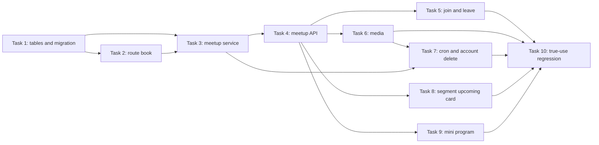

# Meetup Module Implementation Plan

> **For agentic workers:** REQUIRED SUB-SKILL: Use superpowers:subagent-driven-development (recommended) or superpowers:executing-plans to implement this plan task-by-task. Steps use checkbox (`- [ ]`) syntax for tracking.

**Goal:** Build the v1 meetup and route book modules from the shipped v1.8 design doc, without changing existing core user/activity/segment flows except the two spec-approved reverse hooks.

**Architecture:** Add `app/route_book/` and `app/meetup/` as removable rooms beside the existing building: route books store reusable route drawings, meetups store time-bound group rides. Existing modules only receive the spec-approved extension points: `scheduler.py` imports `meetup.cron`, `app/user/service.py` gets account-delete cleanup, and `app/segment/router.py` gets one upcoming-meetups endpoint.

**Tech Stack:** Python 3.11, FastAPI sync routes, SQLAlchemy 2.0 sync session, Alembic, PostgreSQL 16 + PostGIS, pytest, WeChat Mini Program.

---

## Evidence Ledger

- [✓ grep] v1 scope is 5 functions and 16.5 days across 3 sprints: `docs/superpowers/specs/2026-05-28-meetup-module-design.md:31-43`.
- [✓ grep] Task 1-10 split is fixed by spec §11: `docs/superpowers/specs/2026-05-28-meetup-module-design.md:533-546`.
- [✓ grep] Four new tables and field contracts are fixed by spec §4: `docs/superpowers/specs/2026-05-28-meetup-module-design.md:80-204`.
- [✓ grep] API endpoint list is fixed by spec §7: `docs/superpowers/specs/2026-05-28-meetup-module-design.md:395-428`.
- [✓ grep] Architecture dependency review must run the forced grep checklist: `docs/agent-rules/agent-collaboration.md:212-232`.
- [✓ grep] Core-table firewall says new features default to new tables/modules: `CLAUDE.md:40-47`.
- [✓ grep] New Alembic model imports belong in `migrations/env.py`: `migrations/env.py:22-31`.

## Task Dependency Graph



No cycle: each later task consumes tables, service functions, or API contracts from earlier tasks; no task sends a dependency back to an earlier one.

## Files By Ownership

`app/route_book/` owns user-created route drawings. It may read `Activity`, parsers, storage, common geo helpers, and `Segment`; nothing upstream imports it except the removable route mount in `app/main.py`.

`app/meetup/` owns meetup lifecycle, participation, media, and completion tick. It may read `RouteBook`, `Segment`, storage, and user IDs; only the three spec-approved hooks outside the module may import it.

`miniprogram/pages/meetups-list/`, `meetup-detail/`, and `meetup-create/` own the v1 user journey: discover a ride, join or leave it, and create a draft then publish.

## Global Conventions

- Status values: `DRAFT`, `OPEN`, `CANCELLED`, `COMPLETED`.
- Pace values: `relaxed`, `cruise`, `training`, `race`.
- City values: `beijing`, `shanghai`, `hangzhou`, `shenzhen`, `chengdu`, `taiyuan`, `unknown`.
- Time cutoff: signup, leave, and cancel stop at `start_time - 30 minutes - 30 seconds`.
- Snapshot rule: DRAFT route edits recalculate `snapshot_*`; publish freezes `snapshot_*`.
- Route book source rule: DB allows activity-derived orphan state after source activity deletion; service requires `source_activity_id` at create time.
- Media rule: DB record first, storage upload second; delete DB record first, storage file second.
- TDD protocol: test author writes the red test first; implementation author makes it green; reviewer checks the test did not simply mirror implementation.
- Commit rule: one task, one commit, with heredoc commit messages.

## Architecture-Layer Forced Grep

Each implementation review must include this independent section:

```text
Architecture dependency review:
user/        <- activity/ <- segment/ <- route_book/ <- meetup/
scheduler.py -> app.meetup.cron
intentional reverse hooks: app/user/service.py -> app.meetup, app/segment/router.py -> app.meetup
```

Run these commands from repo root before approving any task that touches imports:

```bash
grep -rn "from app.meetup\\|import app.meetup" app/user app/activity app/segment
grep -rn "from app.route_book\\|import app.route_book" app/user app/activity app/segment app/meetup
grep -rh "^from app\\.\\|^import app\\." app/meetup/*.py app/route_book/*.py | sort -u
grep -A 1 "单向依赖\\|依赖方向\\|防火墙" CLAUDE.md docs/agent-rules/*.md
```

Expected state during v1:

- `app/user/service.py -> app.meetup` appears only after Task 7.
- `app/segment/router.py -> app.meetup` appears only after Task 8.
- `scheduler.py -> app.meetup.cron` appears only after Task 7.
- `app/activity/` must not import `app.meetup` or `app.route_book`.

## Repository-Wide Plan Sanity Check

Run after editing any card in this folder:

```bash
python3 - <<'PY'
from pathlib import Path
root = Path("docs/superpowers/plans/2026-05-28-meetup-module")
terms = ["TB" + "D", "TO" + "DO", "fill " + "in", "place" + "holder", "类似 " + "Task"]
hits = []
for path in root.rglob("*.md"):
    for i, line in enumerate(path.read_text(encoding="utf-8").splitlines(), 1):
        if any(term in line for term in terms):
            hits.append(f"{path}:{i}:{line}")
if hits:
    raise SystemExit("\n".join(hits))
print("plan text scan clean")
PY
```

## Execution Order

1. Task 1 creates the four-table foundation and Alembic visibility.
2. Task 2 makes route books usable as route drawings.
3. Task 3 adds meetup lifecycle service logic.
4. Task 4 exposes the route and meetup APIs through FastAPI.
5. Task 5 protects join and leave under concurrency.
6. Task 6 adds media upload/delete.
7. Task 7 adds time completion and account-delete cleanup.
8. Task 8 shows upcoming meetups on segment detail.
9. Task 9 builds the mini program journey.
10. Task 10 runs true-use regression and review gates.
